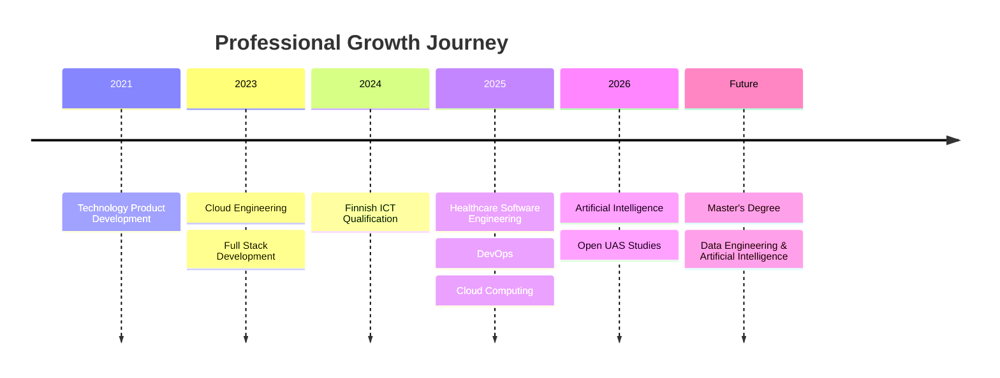

<div align="center">

<p align="center">
  
</p>
# 👋 Hi, I'm Roma Jaiswal

### Cloud Engineer • Full Stack Software Engineer • AI & Data Engineering Enthusiast

📍 **Espoo, Finland 🇫🇮**

[](https://www.linkedin.com/in/romajaiswal11)
[](mailto:roma.jaiswal@algoai.fi)
[](mailto:romafin11@gmail.com)
[](https://github.com/romafin11)

---

### ☁️ Cloud Engineering • 🤖 Artificial Intelligence • 💻 Full Stack Development • ⚙️ DevOps

*"Building secure, scalable, and intelligent software solutions through Cloud Computing, Artificial Intelligence, and Modern Software Engineering."*

</div>

---

# 🚀 Welcome

Welcome to my professional software engineering portfolio.

I am a **Cloud Engineer**, **Full Stack Software Engineer**, and **Artificial Intelligence & Data Engineering enthusiast** passionate about designing secure, scalable, and cloud-native software solutions.

This portfolio showcases my technical projects, professional experience, Finnish education, and continuous learning journey in modern software engineering.

My goal is to contribute to innovative software solutions that combine **Cloud Computing**, **Artificial Intelligence**, **Data Engineering**, and **DevOps** to solve real-world challenges.

---

# 👩‍💻 About Me

I enjoy building software that is:

- Secure
- Scalable
- Maintainable
- Cloud Native
- User Focused

My engineering interests include:

- ☁️ Cloud Engineering
- 💻 Full Stack Development
- 🤖 Artificial Intelligence
- ⚙️ DevOps Engineering
- 🏗 Platform Engineering
- 🌐 REST APIs
- 🐧 Linux Administration
- 🗄 Database Engineering
- 🔒 Secure Software Development

I strongly believe in continuous learning, collaboration, and engineering excellence.

---

# 🛠 Technology Stack

## 💻 Programming

- Python
- Java
- PHP (Laravel)
- JavaScript
- HTML5
- CSS3

---

## ☁️ Cloud Platforms

- Amazon Web Services (AWS)
- Google Cloud Platform (GCP)
- Microsoft Azure

---

## ⚙️ DevOps

- Docker
- Kubernetes
- Terraform
- GitHub Actions
- GitLab CI/CD
- Linux

---

## 🗄 Databases

- PostgreSQL
- MySQL
- MariaDB

---

## 🤖 Artificial Intelligence

- Large Language Models (LLMs)
- Prompt Engineering
- AI-Assisted Development
- Intelligent Automation
- ChatGPT
- Claude

---

# 📈 Professional Journey



---

# 📂 Portfolio Structure

```text
roma-jaiswal-portfolio/
│
├── README.md
│
├── about/
│   └── about-me.md
│
├── education/
│   ├── finland-ict.md
│   ├── metropolia.md
│   └── certifications.md
│
├── experience/
│   ├── algoai.md
│   ├── medigoo.md
│   ├── hoiwa.md
│   └── kaaira-techsoft.md
│
├── projects/
│   ├── healthcare-ai-platform.md
│   ├── enterprise-data-platform.md
│   ├── ai-medical-platform.md
│   ├── healthcare-webapp.md
│   └── healthcare-ui-design.md
│
├── skills/
│   ├── programming.md
│   ├── cloud.md
│   ├── devops.md
│   └── ai.md
│
└── assets/
```

---

# 🌟 Featured Projects

| Project | Description |
|---------|-------------|
| 🏥 **Healthcare AI Platform** | Cloud-native healthcare platform integrating Artificial Intelligence, DevOps, and backend engineering. |
| ☁️ **Enterprise Cloud Data Platform** | Enterprise backend platform using cloud-native architecture, Infrastructure as Code, and event-driven design. |
| 🤖 **AI Medical Data Processing Platform** | Healthcare AI solution using Python, Large Language Models, and intelligent workflow automation. |
| 🔒 **Secure Healthcare Web Application** | Secure Linux-based healthcare application with cloud deployment and HTTPS security. |
| 🎨 **Healthcare UI/UX Design System** | User-centered healthcare interface focusing on accessibility and responsive design. |

---

# 🎓 Education

## 🇫🇮 Finnish Vocational Qualification in ICT

**Stadin Ammattiopisto, Helsinki**

- Software Development
- 195 / 195 Competence Points
- Final Grade: **4.8 / 5.0**
- Completed in **Finnish**

---

## 🎓 Metropolia University of Applied Sciences

**Open UAS**

Current focus:

- Programming
- Software Engineering
- Artificial Intelligence
- Cloud Computing
- Data Engineering

---

# 🎯 Current Focus

Currently expanding my expertise in:

- Artificial Intelligence
- Data Engineering
- Cloud Architecture
- Kubernetes
- Platform Engineering
- Software Architecture
- Distributed Systems

while preparing for postgraduate studies in **Data Engineering and Artificial Intelligence**.

---

# 💡 Professional Values

- Continuous Learning
- Engineering Excellence
- Innovation
- Collaboration
- Responsible AI
- Cloud-Native Engineering
- User-Centered Design
- Lifelong Professional Development

---

# 🤝 Let's Connect

📍 **Espoo, Finland**

### 📧 Professional **roma.jaiswal@algoai.fi**

### 📧 Personal **romafin11@gmail.com**

### 💼 LinkedIn **https://www.linkedin.com/in/romajaiswal11**

### 🌐 GitHub Profile **https://github.com/romafin11**

### 📂 Portfolio Repository **https://github.com/romafin11/roma-jaiswal-portfolio**

---

# 📜 License

This portfolio has been created for educational, professional, and career development purposes. Proprietary source code, confidential business information, customer data, and implementation-specific details have been intentionally omitted.

---

<div align="center">

## ⭐ Thank You for Visiting!

*"Every project is an opportunity to learn. Every challenge is an opportunity to grow. Every solution is an opportunity to create meaningful impact through technology."*

### 🚀 Let's build innovative, secure, and intelligent software together.

</div>
