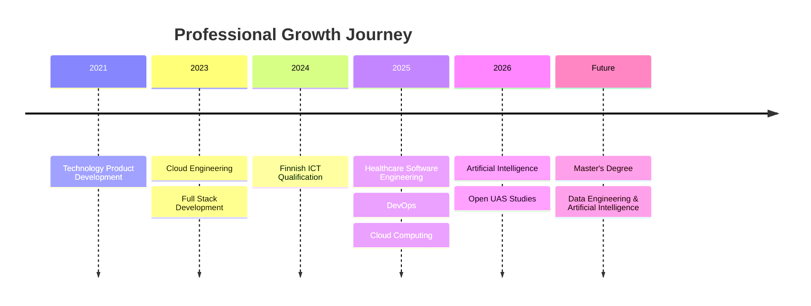

# roma-jaiswal-portfolio
Professional portfolio of Roma Jaiswal, Cloud Engineer, Full Stack Developer, and AI &amp; Data Engineering enthusiast showcasing projects, technical skills, certifications, and software engineering experience.

# 📂 Portfolio Structure

```text

roma-portfolio/
│
├── README.md
├── assets/
│   ├── images/
│   ├── certificates/
│   ├── resume/
│   └── screenshots/
│
├── about/
│   └── about-me.md
│
├── education/
│   ├── finland-ict.md
│   ├── metropolia.md
│   └── certifications.md
│
├── experience/
│   ├── algoai.md
│   ├── medigoo.md
│   ├── hoiwa.md
│   └── kaaira-techsoft.md
│
├── projects/
│   ├── healthcare-ai-platform.md
│   ├── enterprise-data-platform.md
│   ├── ai-medical-platform.md
│   ├── healthcare-webapp.md
│   └── healthcare-ui-design.md
│
├── skills/
│   ├── cloud.md
│   ├── ai.md
│   ├── devops.md
│   └── programming.md
│
└── contact.md
```

<div align="center">

# 👋 Hi, I'm Roma Jaiswal

### Cloud Engineer • Full Stack Software Engineer • AI & Data Engineering Enthusiast

📍 **Espoo, Finland**

[](https://www.linkedin.com/in/romajaiswal11)
[](mailto:roma.jaiswal@algoai.fi)
[](mailto:romafin11@gmail.com)

---

### **Cloud Engineering • Artificial Intelligence • Full Stack Development • DevOps**

*"Building secure, scalable, and intelligent software solutions through Cloud Computing, Artificial Intelligence, and Modern Software Engineering."*

</div>

---

# 🚀 Welcome

Welcome to my professional software engineering portfolio.

I am a **Cloud Engineer**, **Full Stack Software Engineer**, and **Artificial Intelligence & Data Engineering enthusiast** based in **Espoo, Finland**. This portfolio showcases my professional experience, technical projects, Finnish education, and continuous learning journey.

My work focuses on designing cloud-native applications, backend services, AI-powered solutions, and DevOps automation while following modern software engineering best practices.

---

# 👩‍💻 About Me

I enjoy building software that solves real-world challenges through modern engineering practices.

My interests include:

- ☁️ Cloud Engineering
- 💻 Full Stack Software Development
- ⚙️ DevOps & Platform Engineering
- 🤖 Artificial Intelligence
- 🌐 REST API Development
- 🐧 Linux Administration
- 🗄 Database Engineering
- 🔒 Secure Software Engineering

I believe continuous learning, collaboration, and innovation are essential for delivering software that creates meaningful value.

---

# 🛠 Technology Stack

### 💻 Programming

- Python
- Java
- PHP (Laravel)
- JavaScript
- HTML5
- CSS3

### ☁️ Cloud Platforms

- Amazon Web Services (AWS)
- Google Cloud Platform (GCP)
- Microsoft Azure

### ⚙️ DevOps

- Docker
- Kubernetes
- Terraform
- GitHub Actions
- GitLab CI/CD

### 🗄 Databases

- PostgreSQL
- MySQL
- MariaDB

### 🤖 Artificial Intelligence

- Large Language Models (LLMs)
- Prompt Engineering
- AI-Assisted Development
- Intelligent Automation
- ChatGPT
- Claude

---

# 🏗 Professional Journey



---

# 📂 Portfolio

## 👤 About

- 📖 [About Me](about/about-me.md)

---

## 🎓 Education

- 🇫🇮 [Finnish Vocational Qualification in ICT](education/finland-ict.md)
- 🎓 [Metropolia University of Applied Sciences](education/metropolia.md)
- 🏆 [Professional Certifications](education/certifications.md)

---

## 💼 Professional Experience

- ☁️ [ALGOAI Oy](experience/algoai.md)
- 🏥 [Medigoo Oy](experience/medigoo.md)
- 🎨 [Hoiwa Oy](experience/hoiwa.md)
- 🤝 [Kaaira Techsoft](experience/kaaira-techsoft.md)

---

## 🚀 Featured Projects

| Project | Description |
|---------|-------------|
| 🏥 **Healthcare AI-Enabled Cloud Platform** | AI-powered cloud-native healthcare platform integrating DevOps, cloud infrastructure, and backend engineering. |
| ☁️ **Enterprise Cloud Data Platform** | Enterprise backend platform featuring cloud-native architecture, event-driven integration, and CI/CD automation. |
| 🤖 **AI-Driven Medical Data Processing Platform** | Healthcare AI solution using Python, Large Language Models, and intelligent workflow automation. |
| 🔒 **Secure Healthcare Web Application Platform** | Secure cloud-hosted healthcare application with Linux administration, HTTPS, and deployment automation. |
| 🎨 **Healthcare User Experience & Interface Design System** | User-centered healthcare UI/UX design emphasizing accessibility and responsive experiences. |

---

## 🛠 Technical Skills

- 💻 [Programming & Software Engineering](skills/programming.md)
- ☁️ [Cloud Engineering](skills/cloud.md)
- ⚙️ [DevOps Engineering](skills/devops.md)
- 🤖 [Artificial Intelligence](skills/ai.md)

---

# 🎯 Professional Interests

- Artificial Intelligence
- Data Engineering
- Cloud Computing
- Platform Engineering
- DevOps
- Software Architecture
- Backend Engineering
- Healthcare Technology

---

# 🌱 Professional Values

I believe in:

- Continuous Learning
- Technical Excellence
- Collaboration
- Innovation
- Responsible Engineering
- User-Centered Design
- Lifelong Professional Development

---

# 📈 Current Focus

Currently expanding my expertise in:

- Artificial Intelligence
- Data Engineering
- Cloud Engineering
- Kubernetes
- Platform Engineering
- Software Architecture

while preparing for postgraduate studies in **Data Engineering and Artificial Intelligence**.

---

# 📫 Let's Connect

📍 **Espoo, Finland**

📧 **Professional Email**  
**roma.jaiswal@algoai.fi**

📧 **Personal Email**  
**romafin11@gmail.com**

💼 **LinkedIn**  
https://www.linkedin.com/in/romajaiswal11

🌐 **GitHub**  
https://github.com/<your-github-username>

---

# 📜 License

This portfolio has been created for educational, professional, and career development purposes. The content highlights my learning journey, technical projects, and professional contributions. Proprietary source code, confidential business information, customer data, and implementation-specific details have been intentionally omitted.

---

<div align="center">

## ⭐ Thank You for Visiting!

*"Every project is an opportunity to learn. Every challenge is an opportunity to grow. Every solution is an opportunity to create meaningful impact through technology."*

### 🚀 Let's build innovative, secure, and intelligent software together.

</div>
