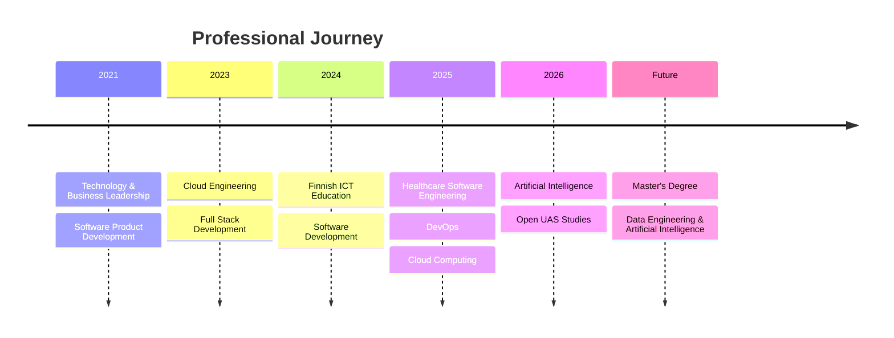
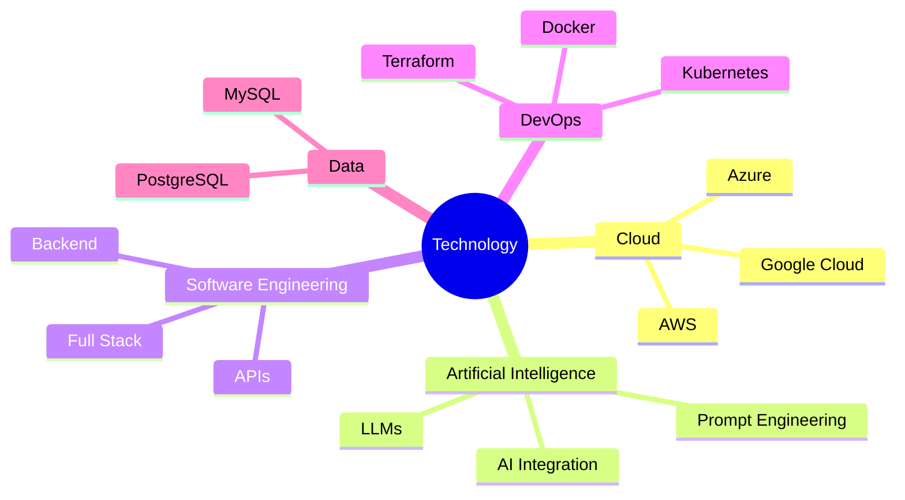

# 👋 About Me

> **Cloud Engineer | Full Stack Software Engineer | AI & Data Engineering Enthusiast**

📍 Espoo, Finland

---

# Welcome

Hello! I'm **Roma Jaiswal**, a software engineer passionate about building secure, scalable, and intelligent software solutions using modern cloud technologies, Artificial Intelligence, and full stack development.

My professional journey combines industry experience, Finnish technical education, and continuous learning. I enjoy solving real-world problems through software engineering while continuously expanding my knowledge in cloud computing, AI, DevOps, and data-driven technologies.

---

# My Journey

---

# Professional Profile

I have experience contributing to modern software engineering projects involving:

- ☁️ Cloud Computing
- 💻 Full Stack Development
- ⚙️ DevOps Engineering
- 🤖 Artificial Intelligence
- 🌐 REST API Development
- 🐧 Linux Administration
- 📊 Database Engineering
- 🔒 Secure Software Development

My work has included cloud-native healthcare platforms, enterprise backend systems, AI-assisted software development, deployment automation, and technical documentation.

---

# Areas of Interest

## ☁️ Cloud Engineering

Designing and supporting scalable cloud-native applications across multi-cloud environments while applying Infrastructure as Code and DevOps best practices.

---

## 🤖 Artificial Intelligence

Exploring practical applications of Artificial Intelligence to improve software development, automate workflows, and build intelligent digital solutions.

Current interests include:

- Large Language Models
- Prompt Engineering
- AI-assisted Software Engineering
- Intelligent Automation

---

## ⚙️ DevOps

Passionate about automating software delivery through:

- CI/CD
- Docker
- Kubernetes
- Terraform
- Infrastructure Automation

---

## 💻 Software Engineering

Enjoy building applications that are:

- Secure
- Scalable
- Maintainable
- User-focused
- Cloud-ready

---

# Technical Interests

---

# Professional Values

I believe great software is built through:

- Continuous Learning
- Collaboration
- Curiosity
- Technical Excellence
- User-Centered Thinking
- Innovation
- Responsible Engineering

---

# Current Focus

I am currently focused on expanding my expertise in:

- Artificial Intelligence
- Data Engineering
- Cloud Computing
- Backend Engineering
- Platform Engineering
- Software Architecture

---

# Career Vision

My long-term goal is to contribute to the development of intelligent, cloud-native software solutions that solve real-world challenges.

I aspire to combine software engineering, Artificial Intelligence, and data engineering to create scalable digital products that improve healthcare, business, and society.

---

# Academic Goals

I am preparing for postgraduate studies in **Data Engineering and Artificial Intelligence**, where I aim to deepen my knowledge of:

- Machine Learning
- Data Engineering
- Distributed Systems
- Cloud Architecture
- AI-powered Software Systems

---

# Beyond Technology

Outside software engineering, I enjoy:

- Exploring emerging technologies
- Learning new programming concepts
- Continuous professional development
- Technical writing and documentation
- Building practical software projects

---

# Professional Philosophy

> *"Technology is most valuable when it solves real-world problems. I believe in building software that is secure, scalable, user-focused, and continuously evolving through innovation and lifelong learning."*

---

# Let's Connect

📍 **Espoo, Finland**

📧 **romafin11@gmail.com**

💼 **LinkedIn:**  
https://www.linkedin.com/in/romajaiswal11

🌐 **GitHub:**  
*(GitHub Profile Link)*

---

*"Every project is an opportunity to learn, every challenge is an opportunity to grow, and every solution is an opportunity to create meaningful impact through technology."*