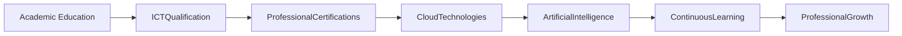
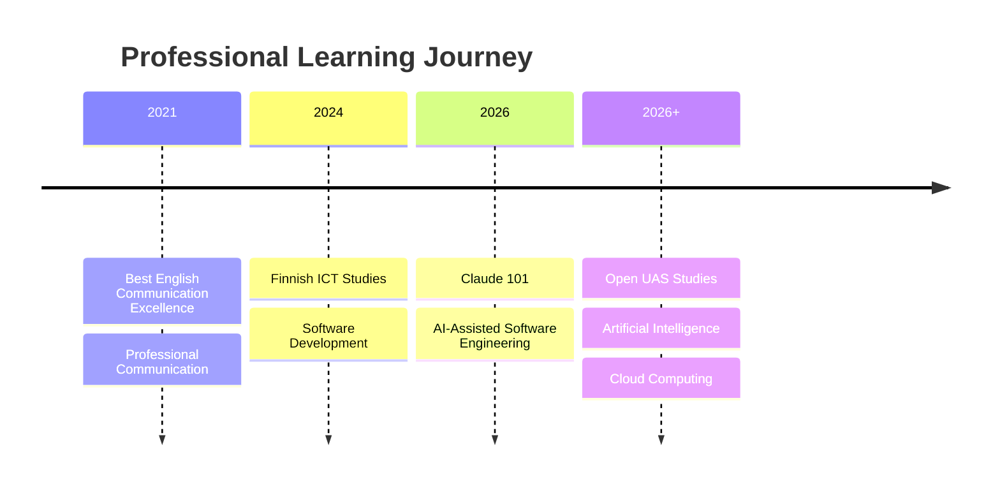
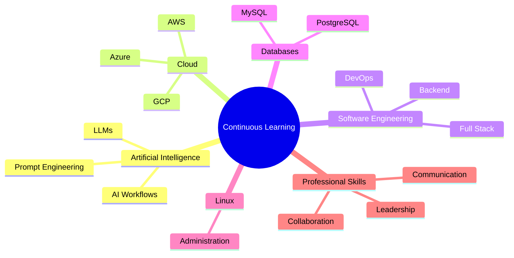

# 🏆 Professional Certifications & Continuous Learning

> **Lifelong Learning | Professional Development | Cloud | Artificial Intelligence | Software Engineering**

---

# Overview

Continuous learning has been a fundamental part of my professional journey. Alongside formal education and industry experience, I actively pursue certifications and professional training to strengthen my expertise in software engineering, cloud computing, Artificial Intelligence, communication, and digital technologies.

These certifications reflect my commitment to staying current with emerging technologies and continuously improving both technical and professional skills.

---

# Professional Learning Journey



---

# Certification Timeline



---

# Technical Certifications

## Claude 101

**Provider:** Anthropic Academy

**Year:** 2026

### Learning Areas

- Artificial Intelligence
- Large Language Models
- Prompt Engineering
- AI-assisted Software Development
- Responsible AI
- Modern AI Workflows

### Skills Gained

- Working with Large Language Models
- AI-assisted engineering
- Prompt optimization
- AI productivity techniques
- Modern development workflows

---

# Academic Qualification

## Finnish Vocational Qualification in ICT

**Institution**

Stadin Ammattiopisto

**Completed**

2026

### Highlights

- Software Development
- Cloud Technologies
- Linux
- Databases
- Web Development
- Programming

Successfully completed **195 Competence Points** with a final grade of **4.8 / 5.0**.

---

# Professional Recognition

## Best English Communication Excellence

**Organization**

Kaaira Techsoft

**Year**

2021

### Recognition

Awarded in recognition of:

- Professional communication
- Client interaction
- Team collaboration
- Business communication
- Workplace excellence

---

# Customer Service Excellence

**Provider**

Dale Carnegie Training

### Learning Outcomes

- Professional communication
- Customer engagement
- Leadership
- Relationship building
- Problem solving
- Team collaboration

---

# Current Learning

I continue to expand my expertise through independent learning in:

- Artificial Intelligence
- Data Engineering
- Cloud Computing
- DevOps
- Software Architecture
- Large Language Models
- Cloud-native Development
- Modern Software Engineering

---

# Learning Areas



---

# Professional Development Philosophy

I believe that technology evolves rapidly, making continuous learning an essential part of every software engineer's career.

My learning approach focuses on:

- Building strong technical foundations
- Applying practical engineering skills
- Learning emerging technologies
- Solving real-world problems
- Sharing knowledge
- Continuous improvement

---

# Skills Strengthened

Through formal education, certifications, and self-directed learning, I have strengthened my expertise in:

### Software Engineering

- Full Stack Development
- Backend Development
- Cloud Computing
- DevOps
- REST APIs

### Artificial Intelligence

- Prompt Engineering
- AI-assisted Development
- Large Language Models
- Intelligent Automation

### Professional Skills

- Communication
- Collaboration
- Leadership
- Technical Documentation
- Continuous Learning

---

# Future Certifications

I plan to continue expanding my expertise in:

- Google Cloud Platform
- Microsoft Azure
- Amazon Web Services
- Kubernetes
- Terraform
- Data Engineering
- Artificial Intelligence
- Machine Learning
- Software Architecture

---

# Professional Growth

Each certification and learning experience has strengthened my ability to contribute effectively to modern software engineering teams while preparing me for advanced academic studies in Artificial Intelligence, Data Engineering, and Cloud Computing.

---

# Digital Certificate Gallery

> Digital certificates will be added here.

```text
assets/certificates/

├── claude-101.png
├── stadin-ict-certificate.pdf
├── dale-carnegie.pdf
├── best-communication-award.jpg
```

---

# Key Takeaway

Continuous learning has been one of the defining aspects of my professional journey. By combining formal education, industry experience, and ongoing professional development, I continue to strengthen my expertise in software engineering, Artificial Intelligence, and cloud technologies while preparing for advanced studies and future engineering leadership opportunities.