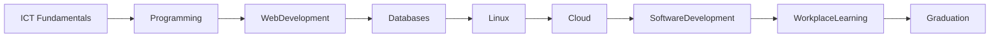
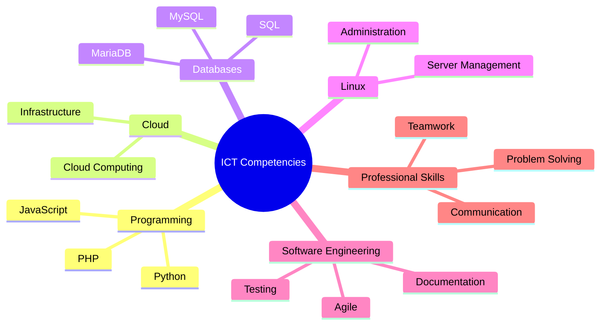

# 🇫🇮 Finnish Vocational Qualification in Information and Communications Technology

> **Software Development | Cloud Computing | Full Stack Development | ICT Engineering**

🏫 **Stadin Ammattiopisto (Stadin AO), Helsinki, Finland**

**Study Period:** August 2024 – June 2026

**Qualification:** Vocational Qualification in Information and Communications Technology  
(*Tieto- ja viestintätekniikan perustutkinto*)

**Specialisation:** Software Development

**Credits:** **195 / 195 Competence Points**

**Final Grade:** **4.8 / 5.0**

---

# Overview

This Finnish vocational qualification provided comprehensive education in modern software engineering, cloud technologies, programming, web development, databases, Linux administration, DevOps, and software development methodologies.

The programme was completed entirely in the **Finnish language**, strengthening both my technical expertise and my ability to work effectively within Finnish educational and professional environments.

The curriculum combined classroom learning with practical projects and workplace training, enabling me to apply theoretical knowledge to real-world software development challenges.

---

# Learning Journey

---

# Academic Focus Areas

## Programming

Developed practical programming skills in:

- Python
- PHP
- JavaScript
- HTML5
- CSS3

Focused on writing clean, maintainable, and reusable code while applying structured software development principles.

---

## Full Stack Development

Built modern web applications using:

- Frontend technologies
- Backend programming
- Database integration
- RESTful APIs
- Authentication
- Responsive design

---

## Cloud Computing

Studied cloud computing concepts including:

- Cloud infrastructure
- Virtualization
- Cloud deployment
- Cloud services
- Infrastructure fundamentals

---

## Linux Administration

Developed practical experience in:

- Linux operating systems
- Shell commands
- File management
- User administration
- Server configuration
- Application deployment

---

## Database Technologies

Worked with relational databases including:

- MySQL
- MariaDB

Learning included:

- Database design
- SQL
- Data modelling
- Database administration

---

## DevOps Fundamentals

Applied modern software delivery practices including:

- Git
- Version Control
- CI/CD concepts
- Deployment workflows
- Collaboration using GitHub

---

## Web Technologies

Developed responsive web applications using:

- HTML5
- CSS3
- JavaScript
- PHP

---

# Software Development Lifecycle

---

# Competency Development

---

# Workplace Learning

A key component of the qualification involved practical workplace learning, where classroom knowledge was applied in real software development environments.

This experience strengthened my ability to:

- Collaborate within Agile teams
- Deliver production-quality software
- Apply professional development practices
- Communicate effectively with stakeholders
- Adapt quickly to modern development environments

---

# Technical Competencies

## Programming

- Python
- PHP
- JavaScript
- HTML5
- CSS3

---

## Databases

- MySQL
- MariaDB

---

## Operating Systems

- Linux

---

## Development Practices

- Software Development
- Debugging
- Version Control
- Documentation
- Testing

---

## Professional Skills

- Problem Solving
- Team Collaboration
- Technical Communication
- Continuous Learning
- Project Documentation

---

# Key Learning Outcomes

Through this qualification I developed practical knowledge in:

- Software engineering principles
- Full stack application development
- Cloud computing fundamentals
- Linux system administration
- Database design and management
- Web application development
- Technical documentation
- Agile software development
- Professional collaboration
- Continuous improvement

---

# Academic Achievement

🏆 Successfully completed all **195 competence points** with a **final grade of 4.8/5.0**, demonstrating consistent academic performance and strong technical capability throughout the programme.

---

# Professional Growth

Completing this qualification significantly strengthened my transition into software engineering by combining technical knowledge with practical industry experience.

The programme enhanced my confidence in:

- Building modern software solutions
- Working in multicultural development teams
- Learning new technologies quickly
- Applying engineering best practices
- Solving real-world technical challenges

Most importantly, studying entirely in Finnish improved my technical communication skills and prepared me for working within Finland's technology ecosystem.

---

# Future Learning

This qualification established a strong foundation for advanced studies in:

- Artificial Intelligence
- Data Engineering
- Cloud Computing
- DevOps
- Software Architecture
- Full Stack Engineering

It also motivated my continued studies through Open UAS and my goal of pursuing a Master's degree in Data Engineering and Artificial Intelligence.

---

# Certificate

> The official qualification certificate and transcript are available upon request.

---

# Key Takeaway

This Finnish ICT qualification represents an important milestone in my professional journey. It provided a strong technical foundation in software engineering while strengthening my ability to work, communicate, and collaborate within the Finnish technology ecosystem. The combination of academic learning and practical workplace experience has prepared me for advanced studies and a career in cloud computing, Artificial Intelligence, and modern software engineering.