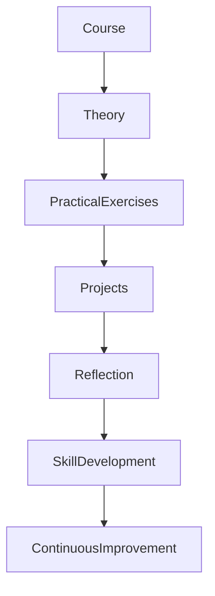
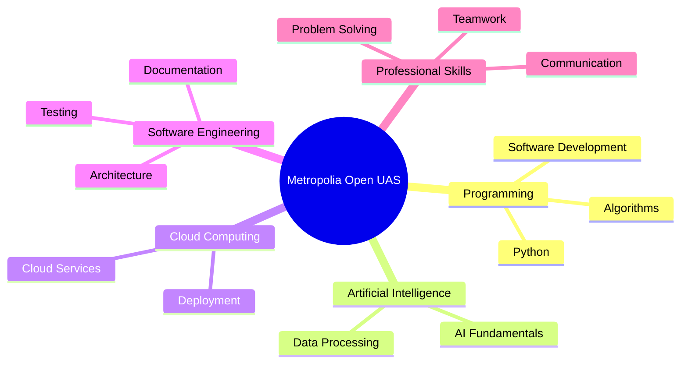
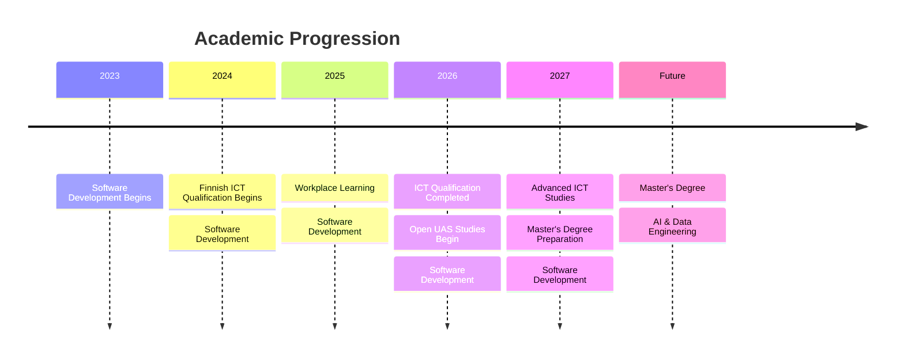

# 🎓 Metropolia University of Applied Sciences

> **Open University Studies | Information and Communication Technology | Continuous Learning**

📍 Helsinki, Finland

**Institution:** Metropolia University of Applied Sciences (Open UAS)

**Study Period:** January 2026 – July 2027 *(Ongoing)*

---

# Overview

To strengthen my technical expertise beyond my vocational qualification, I enrolled in the **Open University of Applied Sciences (Open UAS)** at **Metropolia University of Applied Sciences**.

These studies allow me to deepen my understanding of software engineering, programming, cloud technologies, Artificial Intelligence, and modern digital solutions while preparing for postgraduate studies in **Data Engineering and Artificial Intelligence**.

The programme complements my professional experience by combining academic learning with practical software development and continuous professional growth.

---

# Academic Journey


---

# Learning Objectives

The Open UAS studies are focused on strengthening competencies in:

- Software Engineering
- Programming
- Cloud Computing
- Artificial Intelligence
- Data Engineering
- Modern Application Development
- Problem Solving
- Digital Innovation

---

# Current Areas of Study

## Programming

Developing stronger software engineering skills through practical programming assignments and modern development practices.

Topics include:

- Python
- Software Development
- Programming Concepts
- Problem Solving

---

## Software Engineering

Building knowledge in:

- Software Design
- Application Architecture
- Software Development Lifecycle
- Agile Development
- Testing
- Documentation

---

## Cloud Technologies

Learning cloud computing concepts including:

- Cloud Infrastructure
- Cloud Services
- Cloud-native Development
- Deployment Strategies

---

## Artificial Intelligence

Expanding knowledge in:

- AI Fundamentals
- Intelligent Systems
- Machine Learning Concepts
- Data Processing
- AI-assisted Software Development

---

## Professional Development

Strengthening skills in:

- Critical Thinking
- Technical Communication
- Team Collaboration
- Continuous Learning
- Project-Based Development

---

# Learning Workflow



---

# Competency Development



---

# Academic Skills

## Technical Skills

- Programming
- Software Engineering
- Cloud Computing
- Artificial Intelligence
- Problem Solving

---

## Professional Skills

- Independent Learning
- Research
- Collaboration
- Documentation
- Critical Thinking

---

# Integration with Professional Experience

The Open UAS studies complement my practical experience by allowing me to:

- Apply academic concepts to real software projects.
- Strengthen cloud engineering knowledge.
- Expand Artificial Intelligence skills.
- Improve software architecture understanding.
- Explore modern engineering practices.

---

# Continuous Learning Philosophy

I believe that technology professionals should continuously expand their knowledge through both academic study and practical application.

My Open UAS studies demonstrate my commitment to:

- Lifelong learning
- Technical excellence
- Innovation
- Professional growth
- Academic development

---

# Future Academic Goals

These studies provide a strong academic foundation for pursuing a **Master's Degree in Data Engineering and Artificial Intelligence**, with long-term interests in:

- Artificial Intelligence
- Data Engineering
- Cloud Computing
- Distributed Systems
- Software Architecture
- Intelligent Digital Solutions

---

# Academic Timeline



---

# Professional Growth

The Open UAS programme is helping me bridge academic theory with practical engineering experience. It strengthens my analytical thinking, technical depth, and readiness for advanced studies while supporting my long-term goal of contributing to innovative AI-powered software solutions within Finland's technology ecosystem.

---

# Learning Portfolio

> Course certificates, assignments, and selected projects will be added here.

```text
education/

├── programming-projects/
├── python-assignments/
├── cloud-labs/
├── ai-coursework/
└── study-transcripts/
```

---

# Key Takeaway

My studies at **Metropolia University of Applied Sciences (Open UAS)** represent an important step in my continuous learning journey. They complement my professional experience and Finnish ICT qualification by expanding my knowledge of software engineering, cloud technologies, and Artificial Intelligence while preparing me for a Master's degree and a career in advanced software engineering.
