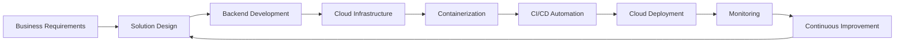
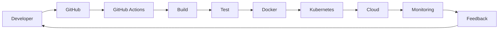
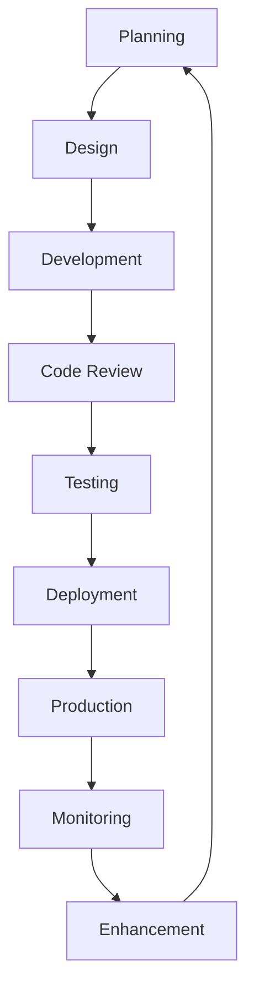

# ALGOAI Oy

> **Partner | Cloud Engineer | Full Stack Software Engineer | AI Solutions Developer**

📍 Espoo, Finland

**Duration:** April 2023 – Present

---

# Overview

ALGOAI Oy is a technology-focused software engineering company dedicated to developing cloud-native applications, AI-enabled digital solutions, and modern web platforms. My role has involved contributing to the design, development, deployment, and continuous improvement of scalable software products using cloud technologies, DevOps practices, and AI-assisted software engineering.

Working in a collaborative Agile environment, I have participated across the software development lifecycle—from solution design and backend development to cloud infrastructure, deployment automation, testing, documentation, and operational support.

---

# Professional Responsibilities

## Full Stack Software Development

- Designed and implemented backend services and RESTful APIs.
- Developed responsive web application features using modern development practices.
- Built scalable and maintainable application components.
- Participated in application architecture discussions and solution design.

---

## Cloud Engineering

Supported deployment and management of applications across multiple cloud platforms including:

- Amazon Web Services (AWS)
- Google Cloud Platform (GCP)
- Microsoft Azure

Key activities included:

- Cloud resource provisioning
- Infrastructure support
- Application deployment
- Environment configuration
- Cloud performance optimization

---

## DevOps Engineering

Contributed to modern DevOps practices by:

- Designing CI/CD pipelines
- Automating application deployment
- Supporting Infrastructure as Code
- Managing containerized environments
- Improving software delivery processes

Technologies:

- GitHub Actions
- Docker
- Kubernetes
- Terraform

---

## AI-Assisted Software Engineering

Applied AI technologies to accelerate software development through:

- Prompt engineering
- LLM integration
- Intelligent workflow automation
- AI-assisted coding
- Rapid prototyping

---

## Infrastructure Automation

Supported automated infrastructure provisioning using Infrastructure as Code principles to improve:

- Repeatability
- Scalability
- Reliability
- Deployment consistency

---

## Security Engineering

Applied secure engineering practices including:

- Identity & Access Management (IAM)
- Secure authentication
- HTTPS & SSL/TLS
- Secrets management
- Secure software development practices

---

## Monitoring & Operations

Contributed to application reliability through:

- Infrastructure monitoring
- Performance analysis
- Operational troubleshooting
- Continuous system improvement

Tools included:

- Grafana
- Prometheus
- CloudWatch

---

## Technical Documentation

Prepared and maintained:

- Deployment documentation
- Architecture documentation
- Configuration guides
- Operational procedures
- Technical implementation documentation

---

# Technology Stack

## Programming

- Python
- Java
- PHP (Laravel)
- JavaScript
- HTML5
- CSS3

---

## Cloud

- Amazon Web Services
- Google Cloud Platform
- Microsoft Azure

---

## DevOps

- Docker
- Kubernetes
- Terraform
- GitHub Actions
- Git

---

## Backend

- REST APIs
- Laravel
- Spring Boot
- Python Services

---

## Database

- PostgreSQL
- MySQL
- MariaDB

---

## AI

- ChatGPT
- Claude
- Prompt Engineering
- LLM Integration
- AI-Assisted Development

---

# Engineering Workflow

---

# Software Delivery Pipeline

---

# Development Lifecycle

---

# Professional Contributions

Throughout my engagement with ALGOAI, I have contributed to:

- Cloud-native application development
- Backend engineering
- Multi-cloud deployment
- Infrastructure automation
- DevOps implementation
- CI/CD automation
- AI-assisted software engineering
- Secure software development
- Technical documentation
- Agile software delivery
- Cross-functional collaboration

---

# Skills Strengthened

Working at ALGOAI enabled me to deepen my expertise in:

- Cloud Engineering
- DevOps
- Full Stack Development
- Infrastructure as Code
- Kubernetes
- Docker
- REST API Development
- AI-assisted Software Engineering
- Linux Administration
- Software Architecture
- Agile Development
- Technical Documentation

---

# Business Impact

The engineering practices adopted during this engagement contributed to:

- Faster software delivery
- Improved deployment reliability
- Scalable cloud infrastructure
- Better operational visibility
- Enhanced application security
- Increased development efficiency through automation
- Improved collaboration across engineering teams

---

# Key Takeaways

Working with ALGOAI has provided valuable experience in designing and delivering modern cloud-native software solutions. The opportunity to work across application development, cloud infrastructure, DevOps, AI-assisted engineering, and technical documentation has strengthened my ability to contribute effectively to multidisciplinary software engineering teams and to build scalable, secure, and maintainable technology solutions.

---

# Confidentiality Notice

This document presents a high-level overview of my professional contributions. To respect client confidentiality and intellectual property, proprietary source code, internal architectures, confidential business information, and implementation-specific details have been intentionally omitted.