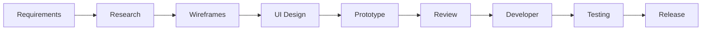
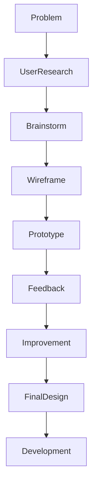
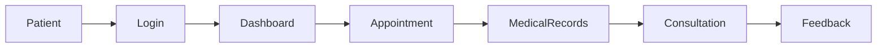

# Hoiwa Oy

> **UI/UX Designer & Visual Experience Intern | Healthcare Digital Product Design**

📍 Espoo, Finland

**Duration:** March 2024 – April 2024

---

# Overview

Hoiwa Oy is a healthcare technology company focused on delivering user-centered digital healthcare solutions. During my internship, I contributed to the design and improvement of healthcare user interfaces by creating wireframes, UI mockups, visual assets, and responsive layouts.

The internship provided practical experience in user experience (UX), interface design (UI), design thinking, accessibility, and collaboration with software development teams to transform business requirements into intuitive digital experiences.

---

# My Role

As a **UI/UX Designer & Visual Experience Intern**, I participated in the design process from concept to prototype, ensuring that healthcare applications remained simple, accessible, and visually consistent.

My responsibilities included:

- User Interface Design
- User Experience Design
- Wireframing
- Interactive Prototyping
- Visual Design
- Responsive Layout Planning
- Design Documentation
- Collaboration with Developers

---

# Key Responsibilities

## User Interface Design

Designed clean and intuitive interfaces for healthcare applications, focusing on:

- Simplicity
- Accessibility
- Consistency
- Ease of navigation
- Modern visual design

---

## Wireframing & Prototyping

Created low- and high-fidelity wireframes to visualize application workflows before development.

Activities included:

- Dashboard layouts
- Login screens
- Appointment booking
- Patient management
- Navigation flows

---

## User Experience (UX)

Applied UX principles to improve usability by:

- Simplifying user journeys
- Reducing cognitive load
- Improving accessibility
- Enhancing interaction flow

---

## Visual Design

Produced visual assets including:

- UI mockups
- Icons
- Healthcare banners
- Presentation graphics
- Informational layouts

---

## Responsive Design

Designed layouts adaptable to:

- Desktop
- Tablet
- Mobile devices

---

## Collaboration

Worked closely with developers and stakeholders by:

- Explaining UI concepts
- Reviewing design feedback
- Supporting implementation
- Maintaining design consistency

---

## Documentation

Prepared design documentation including:

- Wireframes
- UI specifications
- Style guidelines
- Design assets
- Component documentation

---

# Design Workflow



---

# User-Centered Design Process



---

# Healthcare User Journey



---

# Technology & Design Tools

## Design

- Canva
- Wireframing
- Prototyping
- Design Thinking

---

## Frontend Knowledge

- HTML5
- CSS3
- JavaScript

---

## Design Principles

- User-Centered Design (UCD)
- Accessibility
- Responsive Design
- Visual Hierarchy
- Consistent Design System

---

# Key Contributions

- Designed healthcare dashboard layouts.
- Created user interface mockups.
- Developed wireframes for healthcare workflows.
- Planned responsive layouts for multiple devices.
- Improved navigation and usability.
- Produced design documentation.
- Collaborated with software developers.
- Supported implementation of user-centered design practices.

---

# Skills Demonstrated

- UI Design
- UX Design
- Wireframing
- Prototyping
- Design Thinking
- Responsive Design
- Visual Communication
- User Research
- Cross-functional Collaboration
- Technical Documentation

---

# Professional Growth

This internship strengthened my understanding of:

- Human-centered design
- Digital healthcare user experience
- Interface consistency
- Design-to-development collaboration
- Communication with technical teams
- Translating user needs into intuitive interfaces

---

# Business Value

The design improvements contributed to:

- Better usability
- Improved user satisfaction
- Clearer navigation
- Consistent healthcare branding
- Enhanced accessibility
- Efficient collaboration between designers and developers

---

# Project Gallery

> Screenshots and design samples will be added here.

```text
assets/screenshots/dashboard-ui.png

assets/screenshots/wireframe.png

assets/screenshots/prototype.png

assets/screenshots/responsive-layout.png
```

---

# Key Takeaway

My internship at Hoiwa Oy strengthened my ability to design intuitive, user-centered digital healthcare experiences while collaborating effectively with software engineering teams. It reinforced the importance of accessibility, usability, and thoughtful design in building modern healthcare applications and complemented my technical background in software development.

---

# Confidentiality Notice

This portfolio presents a high-level overview of my professional contributions while respecting client confidentiality. Proprietary designs, confidential business information, and implementation-specific details have been intentionally omitted.