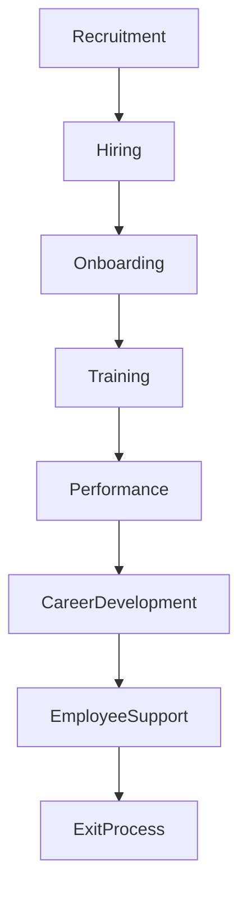
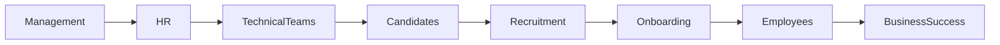

# Kaaira Techsoft

> **HR Specialist | Business Operations | Digital Transformation**

📍 Kolkata, India

**Duration:** Approximately 6 Years

---

# Overview

Kaaira Techsoft is an IT services and technology company where I worked as an **HR Specialist**, supporting recruitment, employee lifecycle management, stakeholder coordination, and business operations.

During this period, I developed strong organizational, communication, and leadership skills while collaborating with technical teams, management, and clients. Working closely with software engineers and project managers also sparked my interest in technology, motivating my transition into software engineering and cloud technologies.

This experience provided a strong foundation in business processes, teamwork, documentation, and project coordination that continues to support my technical career today.

---

# Professional Responsibilities

## Talent Acquisition

- Managed end-to-end recruitment activities.
- Coordinated technical and non-technical interviews.
- Screened candidate profiles.
- Scheduled interviews with hiring managers.
- Supported onboarding activities.

---

## Employee Lifecycle Management

Managed employee processes including:

- Employee onboarding
- Documentation
- Attendance coordination
- Leave management
- Exit formalities
- HR records maintenance

---

## Stakeholder Coordination

Collaborated with:

- Company leadership
- Technical teams
- Project managers
- Recruitment partners
- Employees
- External vendors

Ensured effective communication and smooth operational processes across departments.

---

## Business Operations

Supported daily business operations through:

- Administrative coordination
- Process documentation
- Internal reporting
- Resource planning
- Meeting coordination
- Policy implementation

---

## Documentation

Prepared and maintained:

- HR documentation
- Employee records
- Reports
- Recruitment documentation
- Process guidelines
- Operational documentation

---

## Communication

Responsible for maintaining professional communication with:

- Candidates
- Employees
- Clients
- Management
- External partners

---

# HR Operations Workflow

---

# Employee Lifecycle

---

# Business Collaboration Process

---

# Professional Skills Developed

## Business

- Business Operations
- Process Improvement
- Organizational Planning
- Administration

---

## Human Resources

- Recruitment
- Talent Acquisition
- Employee Relations
- Onboarding
- Documentation

---

## Communication

- Stakeholder Management
- Client Communication
- Team Collaboration
- Professional Communication

---

## Project Support

- Coordination
- Scheduling
- Reporting
- Documentation
- Cross-functional Collaboration

---

# Key Contributions

- Coordinated recruitment and onboarding activities.
- Maintained employee documentation and HR records.
- Supported organizational operations and reporting.
- Collaborated with management and technical teams.
- Improved communication between stakeholders.
- Assisted with business process coordination.
- Contributed to efficient administrative workflows.

---

# Professional Growth

Working at Kaaira Techsoft strengthened my abilities in:

- Leadership and coordination
- Communication
- Problem-solving
- Documentation
- Process management
- Team collaboration
- Organizational planning
- Business operations

Most importantly, this role inspired my transition into software engineering, leading me to pursue formal ICT education in Finland and specialize in cloud computing, DevOps, Artificial Intelligence, and Full Stack Software Development.

---

# Transferable Skills to Software Engineering

The experience gained in Human Resources has been highly valuable in my technical career by strengthening:

- Communication with cross-functional teams
- Agile collaboration
- Technical documentation
- Requirement understanding
- Stakeholder management
- Project coordination
- Customer-focused thinking
- Process optimization

---

# Business Impact

My contributions supported:

- Efficient recruitment processes
- Improved onboarding experience
- Better organizational coordination
- Stronger communication between departments
- Consistent documentation standards
- Effective administrative operations

---

# Recognition

🏆 **Best English Communication Excellence Award (2021)**

This recognition reflected my commitment to professional communication, collaboration, and stakeholder engagement.

---

# Key Takeaway

My experience at Kaaira Techsoft provided a strong professional foundation in communication, leadership, coordination, and business operations. These transferable skills have complemented my transition into software engineering and continue to enhance my ability to collaborate effectively within multidisciplinary technology teams while delivering user-focused digital solutions.

---

# Confidentiality Notice

This document provides a high-level overview of my professional contributions while respecting organizational confidentiality. Proprietary business information, employee records, and internal operational details have been intentionally omitted.