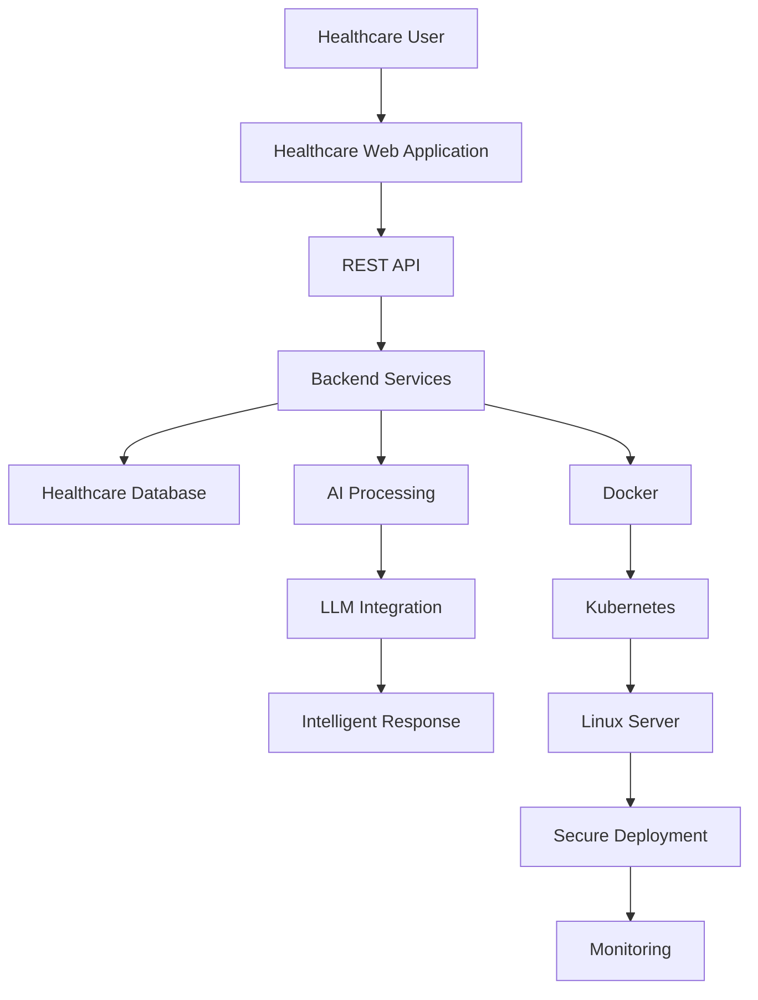
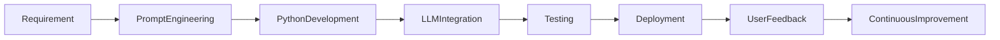
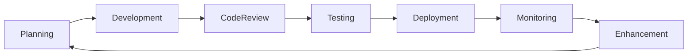

# Medigoo Oy

> **Full Stack Developer | AI Integration Intern | Healthcare Technology**

📍 Espoo, Finland

**Duration:** August 2025 – April 2026

---

# Overview

Medigoo Oy is a healthcare technology company focused on developing secure digital healthcare solutions. During my internships, I contributed to full stack application development, AI integration, cloud deployment, Linux administration, and secure web application configuration.

The experience provided practical exposure to modern software engineering practices, cloud-native development, AI-assisted software engineering, and collaborative Agile development.

---

# Roles

## Full Stack Developer Intern

**August 2025 – November 2025**

Focused on secure healthcare web application deployment, backend development, Linux server administration, database management, and cloud-based application support.

---

## Full Stack & AI Integration Intern

**January 2026 – April 2026**

Focused on Python development, AI integration, prompt engineering, healthcare data processing, intelligent automation, and LLM-powered applications.

---

# Professional Responsibilities

## Full Stack Development

- Developed backend features using PHP and Python.
- Implemented RESTful APIs.
- Supported frontend integration.
- Participated in software testing and debugging.
- Maintained healthcare application functionality.

---

## AI Integration

Worked with modern AI technologies including:

- Large Language Models (LLMs)
- Prompt Engineering
- AI-assisted Development
- Intelligent Automation
- ChatGPT Integration

Responsibilities included:

- Developing AI-assisted workflows
- Improving prompt quality
- Supporting healthcare data processing
- Building intelligent backend services

---

## Cloud & Deployment

Supported application deployment through:

- Linux Server Administration
- Docker
- Kubernetes
- SSH
- Secure Deployment

Worked with cloud-hosted healthcare applications while ensuring reliability and security.

---

## Security Engineering

Applied secure software engineering practices including:

- SSL/TLS
- HTTPS
- API Token Authentication
- Firewall Configuration
- Secure Authentication
- Cloudflare Integration

---

## Database Management

Worked with relational databases including:

- MariaDB
- MySQL

Activities included:

- Database configuration
- Data management
- Backend integration
- Performance support

---

## Linux Administration

Performed:

- SSH access
- Server configuration
- Deployment
- Troubleshooting
- Application maintenance

---

## Technical Documentation

Prepared:

- Deployment documentation
- Configuration guides
- Technical documentation
- Operational notes

---

# Technology Stack

## Programming

- Python
- PHP
- JavaScript
- HTML5
- CSS3

---

## AI

- ChatGPT
- Prompt Engineering
- LLM Integration
- AI-Assisted Development
- Intelligent Automation

---

## DevOps

- Docker
- Kubernetes
- GitHub

---

## Infrastructure

- Linux
- SSH
- PuTTY

---

## Database

- MariaDB
- MySQL

---

## Security

- SSL/TLS
- HTTPS
- Cloudflare
- SMTP
- API Authentication

---

# Healthcare AI Workflow



---

# AI Development Workflow



---

# Software Delivery Lifecycle



---

# Key Contributions

- Developed healthcare application features.
- Supported AI-powered software solutions.
- Implemented backend services using Python and PHP.
- Integrated Large Language Models into healthcare workflows.
- Configured secure web applications.
- Supported Linux-based deployments.
- Worked with Docker and Kubernetes.
- Applied cloud security best practices.
- Prepared technical documentation.
- Collaborated within Agile software engineering teams.

---

# Skills Demonstrated

- Full Stack Development
- Python Development
- AI Integration
- Prompt Engineering
- LLM Applications
- Backend Development
- Linux Administration
- Docker
- Kubernetes
- Database Management
- Secure Software Development
- Technical Documentation
- Agile Development

---

# Professional Growth

My experience at Medigoo strengthened my expertise in:

- Healthcare software engineering
- AI-assisted application development
- Prompt engineering
- Full stack software development
- Linux administration
- Secure web application deployment
- Cloud-native software development
- Containerized applications
- Technical documentation
- Cross-functional collaboration

---

# Business Value

The solutions developed during this engagement contributed to:

- Improved healthcare workflow automation
- Secure healthcare application deployment
- AI-assisted data processing
- Reliable cloud-hosted applications
- Better software quality
- Efficient deployment processes
- Enhanced application security

---

# Project Gallery

> Screenshots, workflow diagrams, and UI demonstrations will be added here.

```
assets/screenshots/medigoo-dashboard.png

assets/screenshots/ai-workflow.png

assets/screenshots/healthcare-ui.png

assets/screenshots/deployment.png
```

---

# Key Takeaway

Working at Medigoo provided valuable experience in combining software engineering with Artificial Intelligence within the healthcare domain. The opportunity to work across backend development, AI integration, secure deployment, Linux administration, and cloud-native technologies strengthened my ability to deliver scalable, secure, and intelligent software solutions while collaborating effectively within Agile engineering teams.

---

# Confidentiality Notice

This document provides a high-level overview of my professional contributions while respecting client confidentiality. Proprietary source code, confidential business information, internal architectures, and implementation-specific details have been intentionally omitted.