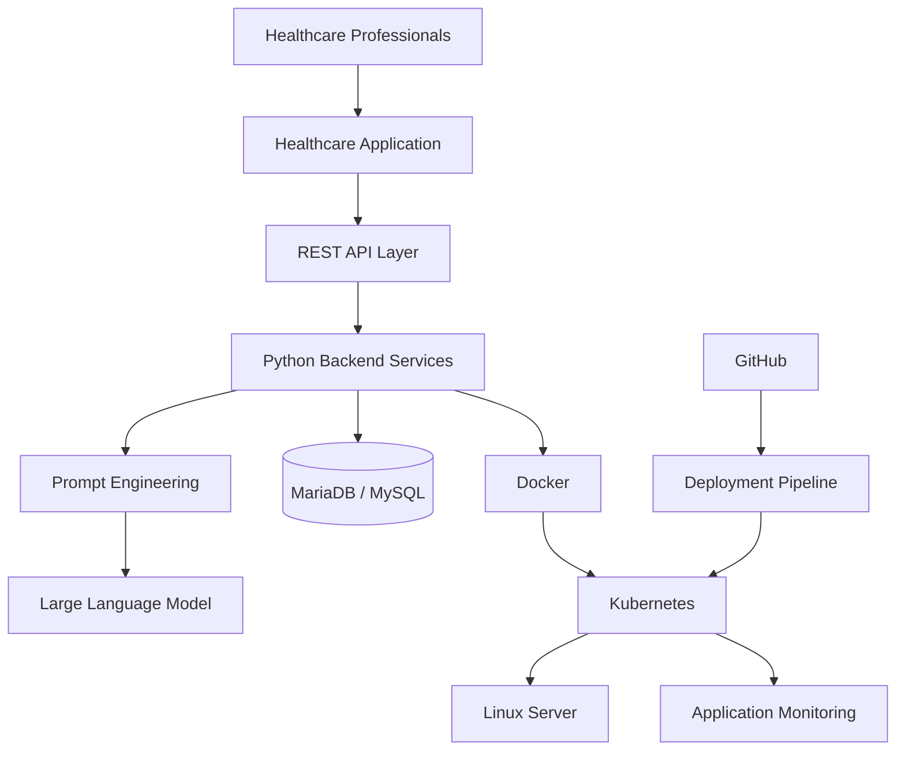
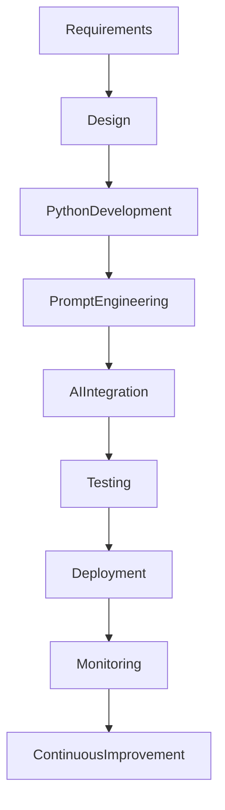

# AI-Driven Medical Data Processing Platform

> **Artificial Intelligence | Healthcare Technology | Python | Cloud-Native Development**

📍 **Medigoo Oy, Espoo, Finland**

**Role:** Full Stack & AI Integration Intern

**Duration:** January 2026 – April 2026

---

# Overview

The **AI-Driven Medical Data Processing Platform** is a healthcare technology solution designed to support intelligent medical data processing through Artificial Intelligence, Large Language Models (LLMs), and cloud-native application development.

The project focused on integrating AI capabilities into healthcare workflows, enabling intelligent data processing, workflow automation, and secure backend services while following modern software engineering and DevOps practices.

Working within an Agile engineering team, I contributed to AI integration, backend development, Linux administration, containerized deployments, database management, and technical documentation.

---

# Primary Engineering Focus

- Artificial Intelligence Integration
- Python Development
- Backend Engineering
- Healthcare Data Processing
- Prompt Engineering
- Containerization
- Cloud Deployment
- Linux Administration
- Technical Documentation

---

# Project Objectives

- Integrate AI into healthcare workflows.
- Develop secure Python backend services.
- Improve healthcare data processing through automation.
- Deploy scalable AI services using containers.
- Support reliable cloud-native application delivery.
- Maintain secure and maintainable software solutions.

---

# Solution Architecture



---

# AI Processing Workflow


---

# AI Development Lifecycle



---

# Professional Responsibilities

## Artificial Intelligence

Worked with modern AI technologies including:

- Large Language Models (LLMs)
- Prompt Engineering
- AI-assisted Development
- Intelligent Workflow Automation

Responsibilities included:

- AI workflow integration
- Prompt optimization
- Intelligent automation
- AI-assisted software development

---

## Python Development

Designed and maintained backend services using Python.

Responsibilities included:

- Backend logic
- API development
- Data processing
- Software maintenance
- Performance improvements

---

## Healthcare Data Processing

Supported healthcare applications by:

- Processing structured medical information
- Managing backend data workflows
- Supporting intelligent data processing
- Improving workflow automation

---

## Database Engineering

Worked with:

- MariaDB
- MySQL

Responsibilities included:

- Database integration
- Backend connectivity
- Data management
- Query optimization

---

## Linux Administration

Supported development and deployment using:

- Linux
- SSH
- Server configuration
- Application deployment
- Troubleshooting

---

## Containerization

Containerized applications using:

- Docker
- Kubernetes

Supporting:

- Scalable deployments
- Application portability
- Reliable environments

---

## Technical Documentation

Prepared and maintained:

- Deployment documentation
- Configuration guides
- AI workflow documentation
- Technical implementation notes

---

# Technology Stack

| Category | Technologies |
|-----------|--------------|
| Programming | Python |
| AI | Large Language Models (LLMs), Prompt Engineering, AI-Assisted Development |
| Backend | REST APIs |
| Containers | Docker, Kubernetes |
| Database | MariaDB, MySQL |
| Infrastructure | Linux, SSH |
| Version Control | GitHub |

---

# Engineering Principles Applied

- AI-Assisted Software Engineering
- Cloud-Native Development
- Containerization
- Secure Software Engineering
- Backend API Design
- Agile Development
- Continuous Learning
- Technical Documentation

---

# Key Contributions

- Integrated AI capabilities into healthcare workflows.
- Developed backend services using Python.
- Applied prompt engineering techniques.
- Supported intelligent medical data processing.
- Containerized applications using Docker.
- Assisted Kubernetes deployments.
- Managed Linux environments.
- Integrated backend services with databases.
- Produced technical documentation.
- Collaborated within Agile software development teams.

---

# Core Competencies

✔ Artificial Intelligence

✔ Python Development

✔ Prompt Engineering

✔ Healthcare Technology

✔ Backend Engineering

✔ Docker

✔ Kubernetes

✔ Linux Administration

✔ REST APIs

✔ Database Integration

✔ Technical Documentation

✔ Agile Software Development

---

# Business Value

The platform demonstrated how Artificial Intelligence can enhance healthcare software by improving workflow automation, supporting intelligent data processing, strengthening backend reliability, and enabling scalable deployment through modern cloud-native engineering practices.

---

# Professional Growth

This project significantly strengthened my understanding of Artificial Intelligence integration, prompt engineering, healthcare software development, backend engineering, Linux administration, container orchestration, and cloud-native application development while working in a collaborative Agile environment.

---

# Project Gallery

> Screenshots, AI workflow diagrams, dashboards, and deployment examples will be added here.

```text
assets/screenshots/ai-dashboard.png

assets/screenshots/llm-workflow.png

assets/screenshots/docker-deployment.png

assets/screenshots/backend-architecture.png

assets/screenshots/monitoring-dashboard.png
```

---

# Key Takeaway

This project provided valuable hands-on experience in applying Artificial Intelligence within healthcare software solutions. It strengthened my ability to design, develop, deploy, and maintain AI-enabled backend applications while combining Python development, cloud-native technologies, containerization, and Agile engineering practices to deliver secure, scalable, and intelligent software systems.

---

# Confidentiality Notice

This portfolio presents a high-level overview of my professional contributions while respecting client confidentiality. Proprietary source code, confidential healthcare information, internal architectures, datasets, and implementation-specific details have been intentionally omitted.