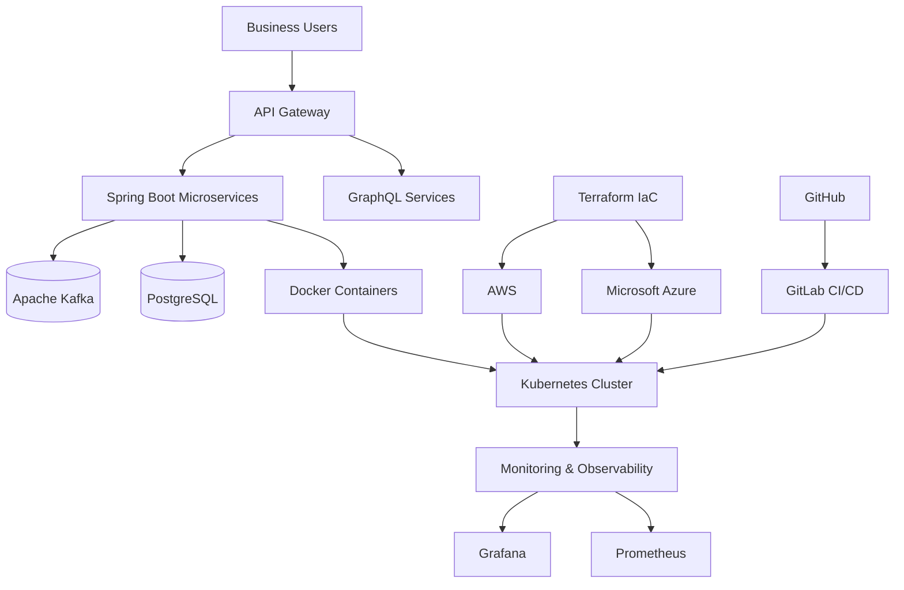
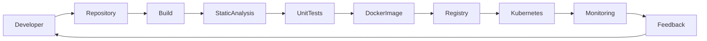
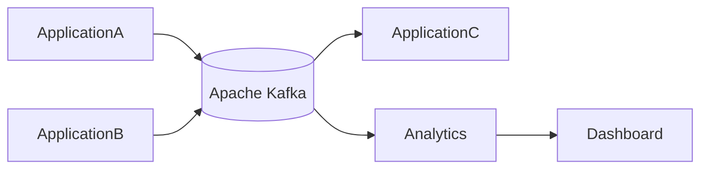

# Enterprise Cloud Data Platform

> **Cloud Engineering | Backend Development | DevOps | Enterprise Integration**

📍 **ALGOAI Oy, Espoo, Finland**

**Duration:** April 2023 – December 2024

---

# Overview

The **Enterprise Cloud Data Platform** is a cloud-native enterprise solution designed to support scalable backend services, secure data processing, and reliable business integrations. The platform combines modern backend technologies, cloud infrastructure, DevOps automation, Infrastructure as Code (IaC), and event-driven architecture to deliver secure, maintainable, and high-performance enterprise applications.

As part of the engineering team, I contributed to backend development, cloud infrastructure, deployment automation, container orchestration, monitoring, and technical documentation while collaborating within Agile software development teams.

---

# Primary Engineering Focus

- Backend Engineering
- Cloud Infrastructure
- DevOps Automation
- Infrastructure as Code (IaC)
- Container Orchestration
- Event-driven Architecture
- Enterprise Integration
- Technical Documentation

---

# Project Objectives

- Deliver scalable cloud-native enterprise services.
- Build secure and maintainable backend systems.
- Automate infrastructure provisioning and software deployment.
- Improve operational reliability and application availability.
- Enable event-driven system integration.
- Enhance software delivery through DevOps automation.

---

# Solution Architecture



---

# CI/CD Delivery Pipeline



---

# Event-Driven Architecture



---

# Professional Responsibilities

## Backend Engineering

- Designed and implemented scalable backend services using **Java** and **Spring Boot** following RESTful architecture principles.
- Developed enterprise APIs supporting secure system integration.
- Contributed to GraphQL-based services for modern client applications.
- Built maintainable backend components following clean software engineering practices.

---

## Cloud Engineering

Supported enterprise cloud infrastructure across:

- Amazon Web Services (AWS)
- Microsoft Azure

Responsibilities included:

- Cloud deployment
- Environment configuration
- Infrastructure management
- Application hosting
- Operational support

---

## DevOps Engineering

Contributed to DevOps automation by implementing CI/CD pipelines, containerized deployments, and Infrastructure as Code to improve deployment reliability and operational efficiency.

Technologies included:

- GitLab CI/CD
- GitHub
- Docker
- Kubernetes
- Terraform

---

## Infrastructure as Code

Provisioned cloud infrastructure using Terraform to achieve:

- Automated deployments
- Infrastructure consistency
- Scalability
- Maintainability
- Repeatable environments

---

## Containerization

Supported deployment using:

- Docker
- Kubernetes
- Helm

Ensured reliable and scalable application hosting across cloud environments.

---

## Monitoring & Observability

Improved operational visibility through centralized monitoring, performance metrics, and proactive health checks using:

- Grafana
- Prometheus

Responsibilities included:

- Infrastructure monitoring
- Performance analysis
- Application health monitoring
- Operational troubleshooting

---

## Security Engineering

Applied enterprise security best practices including:

- Identity & Access Management (IAM)
- Role-Based Access Control (RBAC)
- Secure Authentication
- HTTPS
- Secure API Design

---

## Technical Documentation

Prepared and maintained:

- Architecture documentation
- Deployment guides
- Infrastructure documentation
- API documentation
- Operational procedures
- Technical implementation guides

---

# Technology Stack

| Category | Technologies |
|-----------|--------------|
| Backend | Java, Spring Boot |
| APIs | REST, GraphQL |
| Messaging | Apache Kafka |
| Cloud | AWS, Microsoft Azure |
| DevOps | Docker, Kubernetes, Terraform, GitLab CI/CD |
| Infrastructure | Helm, Infrastructure as Code |
| Database | PostgreSQL |
| Monitoring | Grafana, Prometheus |
| Security | IAM, RBAC, HTTPS |

---

# Engineering Principles Applied

- Cloud-Native Architecture
- Infrastructure as Code
- DevOps Automation
- Continuous Integration & Continuous Delivery
- Secure Software Engineering
- Container Orchestration
- Event-Driven Architecture
- Observability
- Scalability
- Agile Software Development

---

# Key Contributions

- Developed scalable backend services.
- Implemented RESTful and GraphQL APIs.
- Supported event-driven integration using Apache Kafka.
- Automated deployment pipelines using GitLab CI/CD.
- Provisioned cloud infrastructure using Terraform.
- Containerized enterprise applications with Docker and Kubernetes.
- Applied secure cloud engineering practices.
- Produced technical documentation.
- Collaborated within Agile engineering teams.

---

# Core Competencies

✔ Enterprise Software Engineering

✔ Cloud Engineering

✔ Java & Spring Boot

✔ REST API Development

✔ GraphQL

✔ Apache Kafka

✔ Docker

✔ Kubernetes

✔ Terraform

✔ CI/CD Automation

✔ Infrastructure as Code

✔ PostgreSQL

✔ Monitoring & Observability

✔ Technical Documentation

---

# Business Value

The platform improved enterprise software delivery by enabling scalable backend services, automating deployment pipelines, strengthening operational reliability, supporting secure data exchange, and enhancing system observability through modern cloud engineering practices.

---

# Professional Growth

This project significantly strengthened my expertise in enterprise software engineering, cloud-native application development, infrastructure automation, distributed systems, DevOps practices, and scalable backend architecture while working within Agile software delivery teams.

---

# Project Gallery

> Screenshots, architecture diagrams, dashboards, and deployment workflows will be added here.

```text
assets/screenshots/enterprise-dashboard.png

assets/screenshots/cloud-architecture.png

assets/screenshots/event-driven-workflow.png

assets/screenshots/cicd-pipeline.png

assets/screenshots/monitoring-dashboard.png
```

---

# Key Takeaway

This engagement enhanced my ability to design, develop, deploy, and maintain enterprise-scale cloud-native applications while applying modern software engineering principles, DevOps automation, Infrastructure as Code, and secure backend development practices in a collaborative Agile environment.

---

# Confidentiality Notice

This portfolio presents a high-level overview of my professional contributions while respecting client confidentiality. Proprietary source code, confidential business logic, customer data, internal architectures, and implementation-specific details have been intentionally omitted.