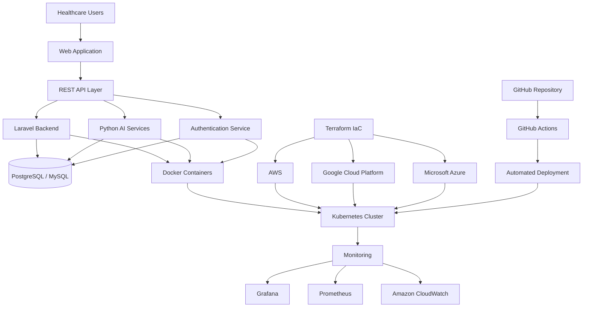
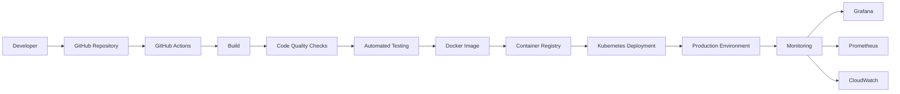

# 🏥 Healthcare AI-Enabled Cloud Platform

> **Cloud Engineering | Full Stack Development | DevOps | AI-Assisted Software Engineering**

---

## 📖 Overview

The **Healthcare AI-Enabled Cloud Platform** is a cloud-native healthcare solution designed to deliver secure, scalable, and intelligent digital healthcare services. The platform leverages modern cloud technologies, DevOps automation, AI-assisted software engineering, and secure backend services to enhance healthcare workflows, streamline deployments, and improve operational efficiency.

Working within an Agile development environment, I contributed to backend application development, cloud infrastructure support, DevOps automation, infrastructure provisioning, container orchestration, and AI-assisted feature integration while ensuring reliability, security, and maintainability.

---

# 👩‍💻 Role

**Cloud Engineer | DevOps Engineer | Full Stack Software Developer**

**Project Duration:** January 2025 – Present

---

# 🎯 Project Objectives

- Build scalable cloud-native healthcare applications.
- Automate infrastructure provisioning and software deployment.
- Implement secure backend services and REST APIs.
- Integrate AI-assisted capabilities into healthcare workflows.
- Improve deployment reliability using CI/CD.
- Ensure operational excellence through monitoring and observability.

---

# 🏗 Solution Architecture



---

# 🔄 CI/CD Workflow



---

# 💼 Key Responsibilities

## Cloud Engineering

- Supported cloud-native application deployment across AWS, Google Cloud Platform (GCP), and Microsoft Azure.
- Assisted with infrastructure provisioning using Infrastructure as Code (Terraform).
- Contributed to cloud infrastructure scalability and operational reliability.

---

## Backend Development

- Developed backend services using **PHP (Laravel)** and **Python**.
- Implemented RESTful APIs supporting healthcare workflows.
- Maintained secure and scalable backend components.

---

## DevOps & Automation

- Designed and maintained CI/CD pipelines using GitHub Actions.
- Automated build, testing, and deployment processes.
- Improved deployment consistency through Infrastructure as Code.

---

## Containerization

- Containerized backend services using Docker.
- Supported Kubernetes deployments.
- Assisted with application deployment across multiple environments.

---

## Cloud Security

Applied cloud security best practices including:

- Identity & Access Management (IAM)
- SSL/TLS
- HTTPS
- Secure Authentication
- Secrets Management

---

## Monitoring & Observability

Implemented monitoring using:

- Amazon CloudWatch
- Grafana
- Prometheus

Responsibilities included:

- Infrastructure monitoring
- Log analysis
- Performance optimization
- Operational troubleshooting

---

## Technical Documentation

Prepared:

- Deployment documentation
- Infrastructure documentation
- Configuration guides
- Operational procedures
- Implementation documentation

---

# 🛠 Technology Stack

| Category | Technologies |
|-----------|--------------|
| Cloud | AWS, Google Cloud Platform, Microsoft Azure |
| Backend | PHP (Laravel), Python |
| APIs | REST APIs |
| DevOps | Docker, Kubernetes, Terraform, GitHub Actions |
| Database | PostgreSQL, MySQL, MariaDB |
| Monitoring | Grafana, Prometheus, Amazon CloudWatch |
| Security | IAM, SSL/TLS, HTTPS, Secrets Management |
| AI | AI-Assisted Development, LLM Integration, Prompt Engineering |

---

# 🌟 Business Value

The platform demonstrates how cloud-native engineering and DevOps automation can improve healthcare software delivery by:

- Improving deployment reliability
- Supporting scalable cloud infrastructure
- Enhancing application security
- Accelerating software delivery through CI/CD
- Enabling intelligent healthcare workflows
- Increasing operational visibility through monitoring

---

# 🚀 Key Contributions

- Developed backend application features and REST APIs.
- Supported cloud infrastructure deployment.
- Automated software delivery using GitHub Actions.
- Implemented Infrastructure as Code with Terraform.
- Containerized applications using Docker and Kubernetes.
- Applied cloud security best practices.
- Contributed to AI-assisted healthcare functionality.
- Produced technical documentation.
- Collaborated within Agile software development teams.

---

# 💡 Skills Demonstrated

- Cloud Engineering
- Full Stack Development
- DevOps Engineering
- Infrastructure as Code
- CI/CD Automation
- Containerization
- Cloud Security
- Linux Administration
- REST API Development
- AI-Assisted Software Engineering
- Technical Documentation
- Agile Methodologies

---

# 📈 Professional Growth

This project strengthened my expertise in:

- Cloud-native architecture
- Multi-cloud environments
- Infrastructure automation
- DevOps culture
- Container orchestration
- Secure software engineering
- Monitoring and observability
- AI-assisted application development
- Cross-functional collaboration

---

# 📷 Project Gallery

> Screenshots, architecture diagrams, and deployment workflows will be added here.

```
assets/screenshots/dashboard.png
assets/screenshots/cloud-architecture.png
assets/screenshots/deployment-pipeline.png
assets/screenshots/monitoring-dashboard.png
```

---

# 🔒 Confidentiality Notice

This portfolio summarizes my professional contributions while respecting client confidentiality. Proprietary source code, confidential business logic, sensitive datasets, and internal implementation details have been intentionally omitted.