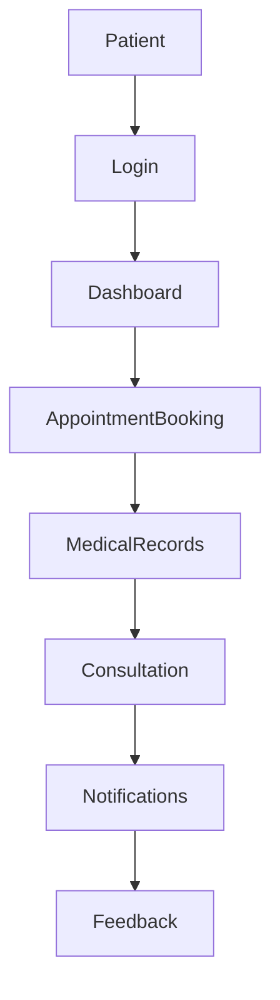

# Healthcare User Experience & Interface Design System

> **UI/UX Design | Digital Healthcare | User-Centered Design | Product Design**

📍 **Hoiwa Oy, Espoo, Finland**

**Role:** UI/UX Designer & Visual Experience Intern

**Duration:** March 2024 – April 2024

---

# Overview

The **Healthcare User Experience & Interface Design System** focused on designing intuitive, accessible, and user-centered digital healthcare experiences. The project aimed to improve usability by creating structured wireframes, interactive prototypes, responsive layouts, and consistent design systems for healthcare applications.

Working closely with software developers and stakeholders, I translated business requirements into user-friendly interfaces while following modern UX principles, accessibility standards, and responsive design practices.

---

# Primary Design Focus

- User Experience (UX)
- User Interface (UI)
- Healthcare Product Design
- Wireframing
- Interactive Prototyping
- Responsive Design
- Design Systems
- Design Documentation

---

# Project Objectives

- Design intuitive healthcare user interfaces.
- Improve usability through user-centered design.
- Build reusable design components.
- Support responsive web experiences.
- Simplify healthcare workflows.
- Strengthen collaboration between design and development teams.

---

# Design Process

```mermaid
flowchart LR

Requirements --> Research

Research --> UserAnalysis

UserAnalysis --> Wireframes

Wireframes --> UIDesign

UIDesign --> Prototype

Prototype --> Review

Review --> DeveloperHandoff

DeveloperHandoff --> Implementation

Implementation --> UserFeedback

UserFeedback --> ContinuousImprovement
```



---

# User Journey



---

# Design-to-Development Workflow


---

# Professional Responsibilities

## User Interface Design

Designed clean, intuitive healthcare interfaces by focusing on:

- Visual consistency
- Accessibility
- Simplicity
- Responsive layouts
- User-friendly navigation

---

## User Experience Design

Applied user-centered design principles to:

- Improve usability
- Simplify workflows
- Reduce user effort
- Enhance navigation
- Support better healthcare interactions

---

## Wireframing & Prototyping

Created:

- Low-fidelity wireframes
- High-fidelity mockups
- Interactive prototypes
- Navigation flows
- Dashboard layouts

---

## Responsive Design

Designed interfaces optimized for:

- Desktop
- Tablet
- Mobile devices

Ensuring a consistent user experience across screen sizes.

---

## Design Systems

Contributed to a consistent visual language through:

- Typography standards
- Color palettes
- UI components
- Layout guidelines
- Design consistency

---

## Developer Collaboration

Worked closely with development teams by:

- Explaining design decisions
- Supporting implementation
- Reviewing UI consistency
- Providing design documentation

---

## Documentation

Prepared:

- Design specifications
- Wireframes
- UI guidelines
- Component documentation
- Prototype documentation

---

# Technology & Design Tools

| Category | Technologies |
|-----------|--------------|
| Design | Canva, Wireframing, Interactive Prototyping |
| Frontend Knowledge | HTML5, CSS3, JavaScript |
| UX Principles | User-Centered Design, Accessibility, Responsive Design |
| Collaboration | Design Reviews, Documentation, Developer Handoff |

---

# Design Principles Applied

- User-Centered Design (UCD)
- Accessibility
- Responsive Design
- Design Thinking
- Visual Consistency
- Information Hierarchy
- Usability
- Iterative Design
- Collaborative Development

---

# Key Contributions

- Designed healthcare dashboard interfaces.
- Created user-centered wireframes and prototypes.
- Improved application usability and navigation.
- Developed responsive layouts for multiple devices.
- Supported implementation through developer collaboration.
- Produced design documentation and UI guidelines.
- Applied accessibility and usability best practices.

---

# Core Competencies

✔ User Experience Design

✔ User Interface Design

✔ Wireframing

✔ Interactive Prototyping

✔ Responsive Design

✔ Design Thinking

✔ Accessibility

✔ Healthcare Product Design

✔ Visual Communication

✔ Design Documentation

✔ Cross-functional Collaboration

---

# Business Value

The design improvements contributed to a more intuitive healthcare application by simplifying user workflows, improving accessibility, increasing interface consistency, and strengthening collaboration between design and engineering teams. These enhancements supported a better overall user experience for healthcare professionals and patients.

---

# Professional Growth

This project strengthened my understanding of user-centered design, healthcare product development, responsive interfaces, accessibility, and collaborative software engineering. It also enhanced my ability to communicate design decisions effectively and work closely with multidisciplinary development teams.

---

# Project Gallery

> Screenshots, wireframes, and design prototypes will be added here.

```text
assets/screenshots/login-screen.png

assets/screenshots/healthcare-dashboard.png

assets/screenshots/wireframe.png

assets/screenshots/prototype.png

assets/screenshots/responsive-layout.png
```

---

# Key Takeaway

This project demonstrated how thoughtful design can improve digital healthcare experiences by balancing usability, accessibility, and technical feasibility. It strengthened my ability to create user-focused interfaces, collaborate with software engineers, and contribute to the successful delivery of modern healthcare applications.

---

# Confidentiality Notice

This portfolio presents a high-level overview of my professional contributions while respecting client confidentiality. Proprietary designs, internal workflows, confidential business information, and implementation-specific details have been intentionally omitted.