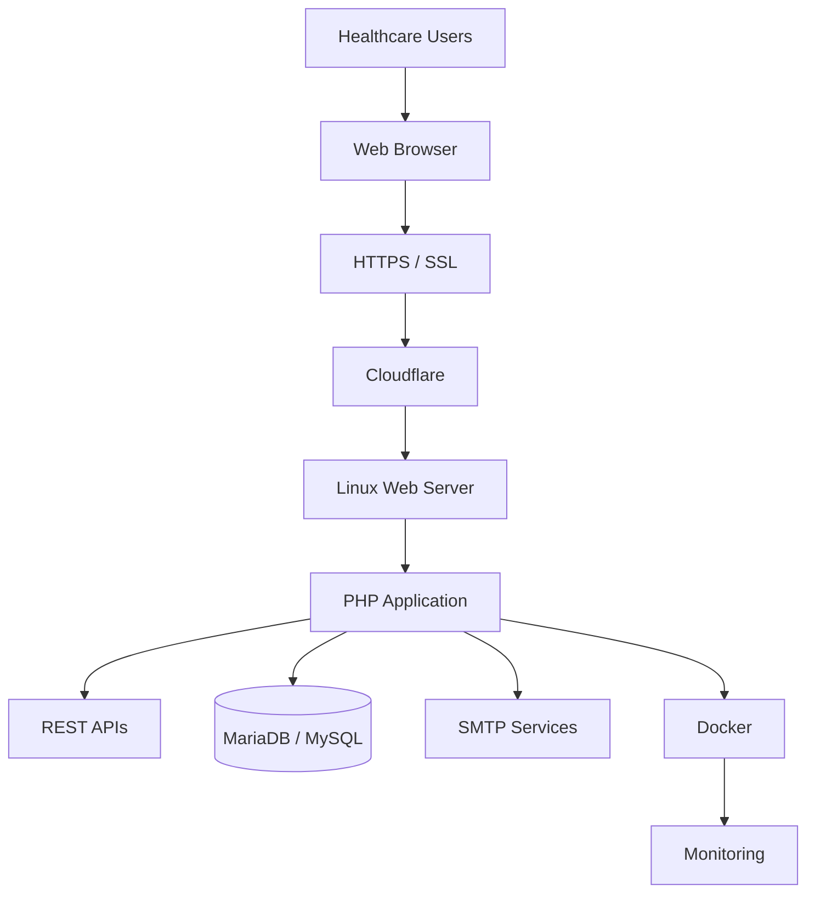
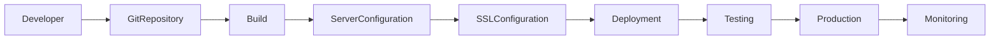
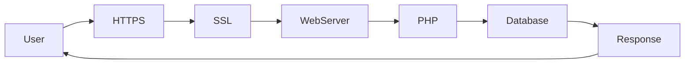

# Secure Healthcare Web Application Platform

> **Full Stack Development | Cloud Deployment | Linux Administration | Web Security**

📍 **Medigoo Oy, Espoo, Finland**

**Role:** Full Stack Developer Intern

**Duration:** August 2025 – November 2025

---

# Overview

The **Secure Healthcare Web Application Platform** is a cloud-hosted healthcare solution designed to provide secure, reliable, and accessible digital healthcare services. The project focused on deploying and maintaining a PHP-based healthcare application while implementing modern web security standards, backend integration, Linux server administration, and cloud infrastructure support.

Working within an Agile development team, I contributed to application deployment, server configuration, database integration, SSL implementation, and secure web application delivery using cloud-native engineering practices.

---

# Primary Engineering Focus

- Full Stack Development
- Healthcare Web Applications
- Linux Administration
- Cloud Deployment
- Web Security
- Backend Integration
- Database Management
- Technical Documentation

---

# Project Objectives

- Deploy secure healthcare web applications.
- Implement HTTPS and SSL/TLS encryption.
- Configure cloud-hosted Linux servers.
- Improve deployment reliability.
- Ensure secure authentication and communication.
- Deliver scalable healthcare services.

---

# Solution Architecture



---

# Secure Deployment Workflow



---

# HTTPS Security Workflow



---

# Professional Responsibilities

## Full Stack Development

- Supported PHP-based healthcare applications.
- Implemented backend functionality.
- Integrated RESTful APIs.
- Assisted application maintenance and improvements.

---

## Linux Administration

Performed:

- Linux server configuration
- SSH administration
- Deployment support
- Server troubleshooting
- Application hosting

---

## Cloud Deployment

Supported deployment activities including:

- Cloud-hosted environments
- Production deployment
- Environment configuration
- Application maintenance

---

## Database Engineering

Worked with:

- MariaDB
- MySQL

Responsibilities included:

- Database connectivity
- Data management
- Backend integration
- Query support

---

## Web Security

Implemented security best practices including:

- HTTPS
- SSL/TLS
- Let's Encrypt
- Cloudflare
- Secure Authentication
- API Token Security

---

## Email Infrastructure

Configured:

- SMTP services
- Email notifications
- System alerts

---

## Technical Documentation

Prepared:

- Deployment guides
- Server documentation
- Configuration documentation
- Security documentation
- Operational procedures

---

# Technology Stack

| Category | Technologies |
|-----------|--------------|
| Backend | PHP |
| Frontend | HTML5, CSS3, JavaScript |
| Database | MariaDB, MySQL |
| Infrastructure | Linux, SSH |
| Security | HTTPS, SSL/TLS, Let's Encrypt, Cloudflare |
| Communication | SMTP |
| Deployment | Docker |
| APIs | REST APIs |

---

# Engineering Principles Applied

- Secure Software Development
- Cloud-Native Deployment
- Linux System Administration
- Infrastructure Security
- RESTful API Integration
- Continuous Improvement
- Technical Documentation
- Agile Software Development

---

# Key Contributions

- Supported deployment of healthcare web applications.
- Configured Linux-based production servers.
- Implemented HTTPS using SSL/TLS certificates.
- Integrated Cloudflare for enhanced security and performance.
- Configured SMTP services for application communication.
- Managed backend database connectivity.
- Applied secure authentication practices.
- Produced deployment and configuration documentation.
- Collaborated with developers in Agile software delivery.

---

# Core Competencies

✔ Full Stack Development

✔ Linux Administration

✔ PHP Development

✔ Healthcare Technology

✔ Cloud Deployment

✔ SSL/TLS Security

✔ Cloudflare

✔ SMTP Configuration

✔ Database Management

✔ REST APIs

✔ Technical Documentation

✔ Agile Software Development

---

# Business Value

The platform improved healthcare software delivery by providing secure web access, reliable backend integration, encrypted communication, efficient deployment processes, and a stable cloud-hosted environment that enhanced application availability and user trust.

---

# Professional Growth

This project strengthened my practical experience in secure web application deployment, Linux administration, cloud-hosted infrastructure, backend integration, HTTPS implementation, and production support. It reinforced the importance of security, reliability, and operational excellence in healthcare software engineering.

---

# Project Gallery

> Screenshots and deployment examples will be added here.

```text
assets/screenshots/login-page.png

assets/screenshots/healthcare-dashboard.png

assets/screenshots/linux-server.png

assets/screenshots/ssl-configuration.png

assets/screenshots/deployment-workflow.png
```

---

# Key Takeaway

This project provided valuable hands-on experience in deploying and maintaining secure healthcare web applications within cloud environments. It enhanced my expertise in Linux administration, web security, backend development, and production deployment while strengthening my understanding of building reliable, secure, and scalable healthcare software solutions.

---

# Confidentiality Notice

This portfolio presents a high-level overview of my professional contributions while respecting client confidentiality. Proprietary source code, confidential healthcare information, internal architectures, deployment configurations, and implementation-specific details have been intentionally omitted.