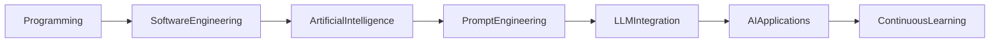
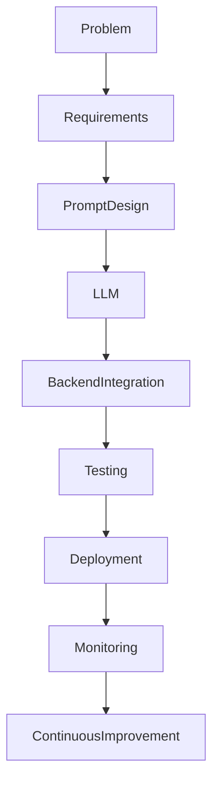
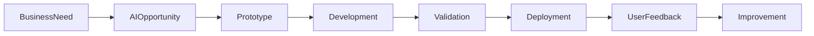

# 🤖 Artificial Intelligence

> **AI-Assisted Software Engineering | Large Language Models | Intelligent Automation**

---

# Overview

Artificial Intelligence has become an integral part of modern software engineering. My journey in AI combines academic learning, practical software development, and hands-on experience integrating AI-powered capabilities into healthcare and enterprise applications.

I have worked with Large Language Models (LLMs), prompt engineering, AI-assisted development tools, and intelligent automation to improve software delivery, enhance developer productivity, and build smarter digital solutions.

Rather than viewing AI as a replacement for software engineering, I see it as a powerful engineering tool that enables faster development, improved decision-making, and more innovative products.

---

# AI Learning Journey

---

# AI Areas of Interest

## Large Language Models (LLMs)

Hands-on experience working with LLM-powered applications and AI-assisted workflows.

Topics include:

- LLM Integration
- AI-assisted Software Development
- Intelligent Automation
- Context-aware Applications
- AI-enhanced User Experiences

---

## Prompt Engineering

Experience designing and refining prompts to improve AI-generated outputs.

Focus areas include:

- Prompt Optimization
- Structured Prompt Design
- Context Engineering
- AI Workflow Design

---

## AI-Assisted Development

Using modern AI tools to improve software engineering productivity while maintaining software quality.

Examples include:

- Code Generation
- Documentation Assistance
- Code Review Support
- Debugging Assistance
- Rapid Prototyping

---

## Healthcare AI

Applied AI concepts in healthcare software by supporting:

- Medical Data Processing
- Intelligent Workflow Automation
- AI-assisted Backend Services
- Healthcare Information Processing

---

# AI Development Workflow

---

# AI Software Development Lifecycle

---

# AI Technology Stack

| Category | Technologies |
|-----------|--------------|
| AI Platforms | ChatGPT, Claude |
| AI Concepts | Large Language Models (LLMs), Prompt Engineering |
| Programming | Python |
| Backend | REST APIs |
| Deployment | Docker, Kubernetes |
| Cloud | AWS, Azure, Google Cloud Platform |
| Development | GitHub, AI-Assisted Coding Tools |

---

# Practical AI Experience

## AI Integration

- Integrated AI capabilities into healthcare software.
- Supported intelligent backend workflows.
- Applied AI-assisted development techniques.

---

## Prompt Engineering

- Designed structured prompts.
- Improved response quality.
- Optimized AI interactions.

---

## Intelligent Automation

Worked with AI to support:

- Data processing
- Workflow automation
- Developer productivity
- Software engineering tasks

---

## AI-Assisted Engineering

Applied AI tools to:

- Accelerate development
- Improve documentation
- Generate code suggestions
- Support debugging
- Increase engineering efficiency

---

# Engineering Principles Applied

- Responsible AI
- Human-Centered AI
- AI-Assisted Development
- Secure Software Engineering
- Continuous Learning
- Agile Development
- Cloud-Native Engineering

---

# Skills Demonstrated

✔ Artificial Intelligence Fundamentals

✔ Prompt Engineering

✔ Large Language Models (LLMs)

✔ AI-Assisted Software Development

✔ Python

✔ Backend Integration

✔ REST APIs

✔ Intelligent Automation

✔ Cloud-Native Development

✔ Technical Documentation

---

# Professional Growth

Working with AI has strengthened my ability to:

- Build intelligent software solutions.
- Integrate AI into existing applications.
- Design effective prompts for LLMs.
- Combine software engineering with AI capabilities.
- Evaluate AI outputs critically and responsibly.
- Apply AI tools to improve development workflows.

---

# Future Learning Goals

I continue to expand my knowledge in:

- Machine Learning
- Retrieval-Augmented Generation (RAG)
- AI Agents
- Multi-Agent Systems
- Vector Databases
- Data Engineering
- MLOps
- Responsible AI
- AI System Architecture

---

# AI Project Portfolio

Current AI-related work includes:

- Healthcare AI Platform
- AI Medical Data Processing
- Prompt Engineering
- LLM Integration
- AI-Assisted Software Development
- Intelligent Workflow Automation

---

# Learning Resources

I regularly strengthen my AI knowledge through:

- Academic studies
- Hands-on software projects
- Technical documentation
- AI experimentation
- Open-source communities
- Continuous professional learning

---

# Key Takeaway

Artificial Intelligence is transforming the way software is designed, developed, and maintained. My experience integrating AI into healthcare and cloud-native applications, combined with continuous learning, has strengthened my ability to build practical, secure, and scalable AI-enabled software solutions. I look forward to further advancing my expertise through Master's studies in **Data Engineering and Artificial Intelligence**.

---

# Professional Philosophy

> *"Artificial Intelligence is most powerful when combined with strong software engineering principles, human creativity, and responsible innovation."*