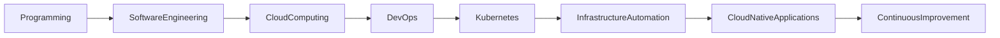
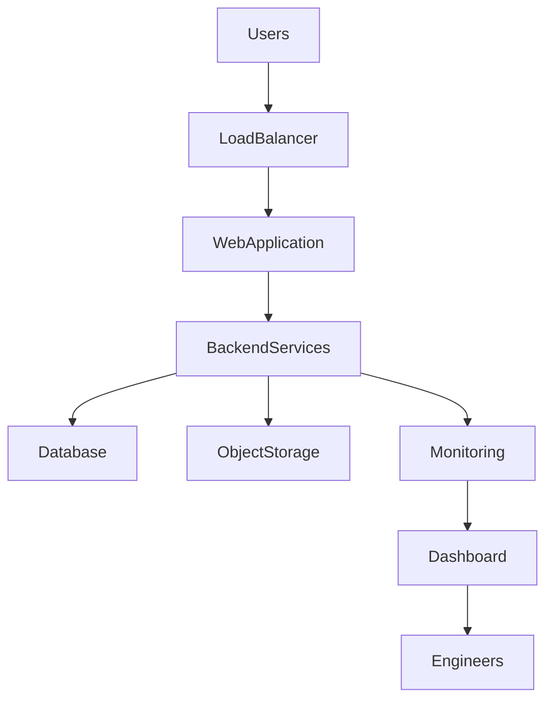
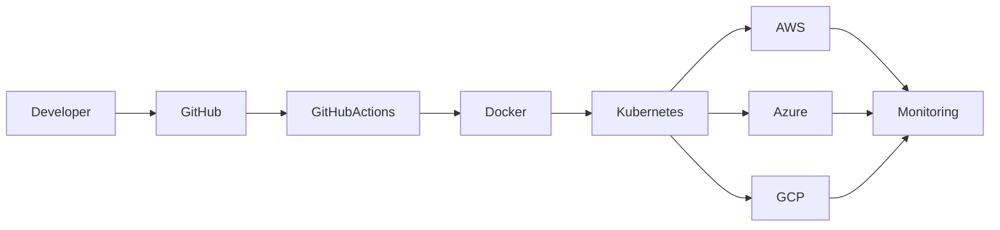
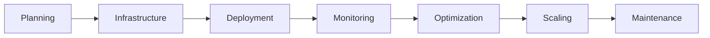

# ☁️ Cloud Engineering

> **Multi-Cloud Architecture | Cloud-Native Applications | Infrastructure Automation | DevOps**

---

# Overview

Cloud computing is at the core of modern software engineering. Throughout my academic journey and professional experience, I have developed practical knowledge in designing, deploying, and supporting cloud-native applications across multiple cloud platforms.

My cloud engineering experience combines application deployment, infrastructure automation, containerization, monitoring, security, and DevOps practices to build scalable, secure, and maintainable software solutions.

---

# Cloud Engineering Journey

---

# Cloud Platforms

## ☁️ Amazon Web Services (AWS)

Experience includes:

- Cloud-hosted applications
- Infrastructure support
- Application deployment
- Cloud monitoring
- Security implementation
- Production environments

---

## ☁️ Google Cloud Platform (GCP)

Worked with:

- Cloud services
- Cloud-native applications
- Infrastructure support
- AI-enabled cloud solutions
- Cloud administration

---

## ☁️ Microsoft Azure

Experience includes:

- Cloud deployment
- Infrastructure management
- Application hosting
- Cloud services
- Multi-cloud environments

---

# Cloud Architecture

---

# Multi-Cloud Deployment

---

# Cloud Infrastructure Lifecycle

---

# Cloud Engineering Competencies

## Cloud Infrastructure

- Cloud deployment
- Infrastructure management
- Environment configuration
- Resource provisioning
- Application hosting

---

## Cloud-Native Development

- Scalable applications
- REST APIs
- Backend services
- Cloud deployment
- Containerized workloads

---

## Infrastructure as Code

Worked with:

- Terraform

Applied Infrastructure as Code principles to improve:

- Automation
- Repeatability
- Scalability
- Deployment consistency

---

## Containerization

Experience includes:

- Docker
- Kubernetes

Supporting:

- Containerized applications
- Scalable deployments
- Cloud-native architecture

---

## Monitoring & Observability

Worked with:

- Grafana
- Prometheus
- Amazon CloudWatch

Responsibilities included:

- Infrastructure monitoring
- Performance analysis
- Operational visibility
- Troubleshooting

---

## Cloud Security

Applied cloud security practices including:

- Identity & Access Management (IAM)
- HTTPS
- SSL/TLS
- Secure Authentication
- Secrets Management

---

# Technology Stack

| Category | Technologies |
|-----------|--------------|
| Cloud Platforms | AWS, Google Cloud Platform, Microsoft Azure |
| Containers | Docker, Kubernetes |
| Infrastructure | Terraform |
| CI/CD | GitHub Actions, GitLab CI/CD |
| Monitoring | Grafana, Prometheus, CloudWatch |
| Security | IAM, SSL/TLS, HTTPS |
| Backend | Python, Java, PHP |
| Databases | PostgreSQL, MySQL, MariaDB |

---

# Engineering Principles

- Cloud-Native Architecture
- Infrastructure as Code
- DevOps Automation
- High Availability
- Scalability
- Secure Software Engineering
- Observability
- Continuous Delivery
- Agile Engineering

---

# Practical Experience

Cloud engineering experience gained through:

- Healthcare AI Platform
- Enterprise Cloud Platform
- Healthcare Web Application
- AI Medical Platform

Areas of contribution included:

- Cloud deployment
- Infrastructure automation
- Backend services
- DevOps implementation
- Monitoring
- Security
- Documentation

---

# Core Competencies

✔ Cloud Engineering

✔ AWS

✔ Google Cloud Platform

✔ Microsoft Azure

✔ Docker

✔ Kubernetes

✔ Terraform

✔ Infrastructure as Code

✔ DevOps

✔ CI/CD

✔ Cloud Security

✔ Monitoring & Observability

---

# Professional Growth

Working with cloud technologies has strengthened my ability to:

- Design cloud-native solutions
- Deploy scalable applications
- Automate infrastructure
- Improve operational reliability
- Secure cloud environments
- Monitor production systems
- Collaborate within Agile engineering teams

---

# Future Learning

I continue expanding my expertise in:

- Cloud Architecture
- Kubernetes
- Platform Engineering
- Site Reliability Engineering (SRE)
- MLOps
- Serverless Computing
- Distributed Systems
- Cloud Security
- Data Engineering

---

# Cloud Portfolio

Cloud-related projects included in this portfolio:

- Healthcare AI-Enabled Cloud Platform
- Enterprise Cloud Data Platform
- Secure Healthcare Web Application Platform
- AI-Driven Medical Data Processing Platform

---

# Key Takeaway

Cloud computing has become the foundation of modern software engineering. Through practical experience with AWS, Google Cloud Platform, Microsoft Azure, Infrastructure as Code, containerization, and DevOps automation, I have developed the skills required to build secure, scalable, and cloud-native software solutions.

I continue to deepen my expertise through professional projects, academic studies, and continuous learning, with the goal of specializing in **Cloud Engineering**, **Data Engineering**, and **Artificial Intelligence**.

---

# Professional Philosophy

> *"Cloud engineering is not only about deploying applications—it is about building reliable, scalable, secure, and maintainable platforms that enable innovation."*