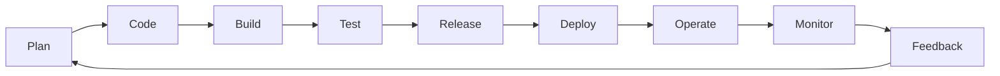
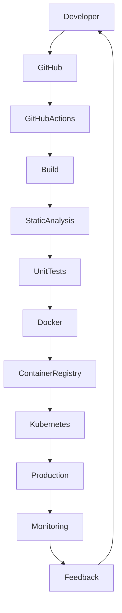

# ⚙️ DevOps Engineering

> **CI/CD | Infrastructure as Code | Cloud Automation | Containerization | Platform Engineering**

---

# Overview

DevOps is more than automation—it is a culture that enables collaboration between software development and operations to deliver reliable, secure, and scalable software.

Through academic learning and practical software engineering experience, I have contributed to building modern DevOps workflows that automate software delivery, improve deployment reliability, and support cloud-native applications.

My experience includes CI/CD automation, Infrastructure as Code (IaC), containerization, cloud deployments, monitoring, Linux administration, and technical documentation.

---

# DevOps Journey

---

# DevOps Lifecycle

---

# CI/CD Pipeline

---

# Infrastructure as Code Workflow

---

# Core DevOps Competencies

## Continuous Integration & Continuous Delivery

Experience with:

- GitHub Actions
- GitLab CI/CD

Applied CI/CD practices to:

- Automate builds
- Execute testing workflows
- Standardize deployments
- Improve software delivery
- Increase deployment reliability

---

## Infrastructure as Code

Worked with:

- Terraform

Applied Infrastructure as Code principles for:

- Infrastructure provisioning
- Configuration management
- Deployment consistency
- Cloud automation
- Repeatable environments

---

## Containerization

Experience includes:

- Docker
- Kubernetes

Supporting:

- Containerized applications
- Scalable deployments
- Cloud-native architecture
- Environment consistency

---

## Cloud Automation

Worked across cloud environments including:

- Amazon Web Services (AWS)
- Google Cloud Platform (GCP)
- Microsoft Azure

Activities included:

- Application deployment
- Infrastructure support
- Environment management
- Cloud configuration

---

## Linux Administration

Supported production environments through:

- Linux server administration
- SSH
- Application deployment
- System troubleshooting
- Configuration management

---

## Monitoring & Observability

Worked with:

- Grafana
- Prometheus
- Amazon CloudWatch

Responsibilities included:

- Infrastructure monitoring
- Performance analysis
- Health monitoring
- Operational support
- Troubleshooting

---

## Security

Applied DevSecOps principles including:

- IAM
- HTTPS
- SSL/TLS
- Secure Authentication
- Secrets Management

---

# Technology Stack

| Category | Technologies |
|-----------|--------------|
| Version Control | Git, GitHub |
| CI/CD | GitHub Actions, GitLab CI/CD |
| Infrastructure | Terraform |
| Containers | Docker, Kubernetes |
| Cloud | AWS, Google Cloud Platform, Microsoft Azure |
| Monitoring | Grafana, Prometheus, CloudWatch |
| Operating System | Linux |
| Security | IAM, SSL/TLS, HTTPS |

---

# Engineering Principles

- DevOps Culture
- Infrastructure as Code
- Continuous Integration
- Continuous Delivery
- Automation First
- Cloud-Native Engineering
- Scalability
- High Availability
- Observability
- Secure Software Delivery
- Agile Development

---

# Practical Experience

Applied DevOps practices while contributing to:

- Healthcare AI Platform
- Enterprise Cloud Data Platform
- Secure Healthcare Web Application
- AI-Driven Medical Data Processing Platform

Responsibilities included:

- CI/CD implementation
- Infrastructure automation
- Docker containerization
- Kubernetes deployment
- Linux administration
- Monitoring
- Technical documentation

---

# Core Competencies

✔ DevOps Engineering

✔ GitHub Actions

✔ GitLab CI/CD

✔ Docker

✔ Kubernetes

✔ Terraform

✔ Infrastructure as Code

✔ Linux Administration

✔ Cloud Deployment

✔ Monitoring & Observability

✔ Secure Software Delivery

✔ Agile Software Development

---

# Professional Growth

Working with DevOps practices has strengthened my ability to:

- Automate software delivery
- Deploy cloud-native applications
- Improve deployment reliability
- Manage containerized environments
- Provision infrastructure efficiently
- Monitor production systems
- Collaborate across development and operations teams

---

# Future Learning

I continue expanding my expertise in:

- Platform Engineering
- Site Reliability Engineering (SRE)
- Kubernetes Administration
- GitOps
- Argo CD
- Helm
- MLOps
- Cloud Security
- Observability Engineering

---

# DevOps Portfolio

DevOps-related work included in this portfolio:

- Healthcare AI-Enabled Cloud Platform
- Enterprise Cloud Data Platform
- AI-Driven Medical Data Processing Platform
- Secure Healthcare Web Application Platform

---

# Key Takeaway

DevOps has transformed the way software is developed, deployed, and maintained. Through practical experience with CI/CD, Infrastructure as Code, containerization, Linux administration, cloud platforms, and monitoring, I have developed a strong foundation in building reliable and scalable software delivery pipelines.

I continue to expand my knowledge of modern DevOps and Platform Engineering practices to support cloud-native applications and contribute to high-performing engineering teams.

---

# Professional Philosophy

> *"Successful DevOps is built on automation, collaboration, continuous improvement, and a shared responsibility for delivering reliable software."*