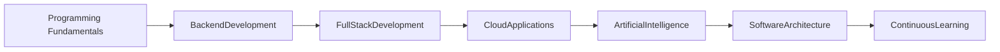
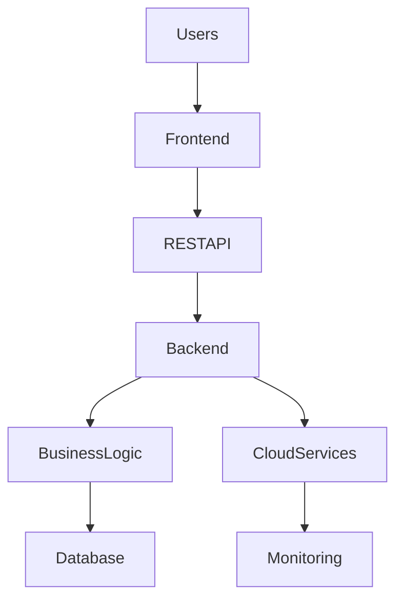
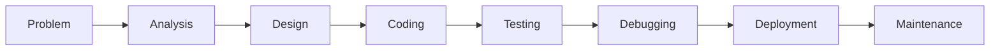

# 💻 Programming & Software Engineering

> **Full Stack Development | Backend Engineering | Clean Code | Modern Software Development**

---

# Overview

Programming is the foundation of software engineering and the driving force behind digital innovation. Throughout my academic studies and professional experience, I have developed applications using modern programming languages, frameworks, and engineering practices to build secure, scalable, and maintainable software solutions.

My programming experience spans backend development, web technologies, RESTful APIs, database integration, cloud-native applications, and AI-assisted software engineering.

---

# Software Engineering Journey

---

# Software Development Lifecycle

---

# Application Architecture

---

# Programming Languages

## 🐍 Python

Applied Python in:

- Backend development
- REST API implementation
- AI integration
- Healthcare applications
- Automation
- Data processing

---

## ☕ Java

Worked with Java for:

- Enterprise backend development
- Spring Boot applications
- RESTful services
- Scalable software architecture

---

## 🌐 JavaScript

Developed interactive web applications using:

- JavaScript
- HTML5
- CSS3

Focus areas included:

- User interfaces
- Client-side functionality
- Web application development

---

## 🐘 PHP

Developed backend applications using Laravel for:

- Healthcare systems
- API development
- Database integration
- Secure web applications

---

# Backend Engineering

Experience includes:

- REST API Development
- Backend Services
- Business Logic
- Authentication
- Database Integration
- Cloud Deployment

---

# Database Development

Worked with relational databases including:

- PostgreSQL
- MySQL
- MariaDB

Activities included:

- Database design
- SQL queries
- Data management
- Backend integration

---

# API Development

Developed and integrated:

- REST APIs
- Backend Services
- API Authentication
- Secure Data Exchange

---

# Software Engineering Practices

Applied modern engineering principles including:

- Clean Code
- Modular Design
- Version Control
- Agile Development
- Technical Documentation
- Continuous Improvement

---

# Technology Stack

| Category | Technologies |
|-----------|--------------|
| Programming | Python, Java, JavaScript, PHP |
| Backend | Spring Boot, Laravel |
| Frontend | HTML5, CSS3, JavaScript |
| APIs | REST |
| Database | PostgreSQL, MySQL, MariaDB |
| Version Control | Git, GitHub |
| Cloud | AWS, Azure, Google Cloud Platform |

---

# Engineering Principles

- Clean Code
- SOLID Principles
- Modular Design
- Object-Oriented Programming
- RESTful Architecture
- Reusability
- Maintainability
- Scalability
- Secure Software Development
- Agile Methodologies

---

# Programming Workflow

---

# Practical Experience

Programming skills have been applied while contributing to:

- Enterprise Cloud Data Platform
- Healthcare AI Platform
- AI Medical Data Processing Platform
- Secure Healthcare Web Application
- Healthcare User Experience Platform

Key activities included:

- Backend development
- API implementation
- Database integration
- Cloud deployment
- Software maintenance
- Technical documentation

---

# Core Competencies

✔ Python

✔ Java

✔ Spring Boot

✔ PHP (Laravel)

✔ JavaScript

✔ REST APIs

✔ Backend Development

✔ Full Stack Development

✔ Database Integration

✔ Cloud-Native Development

✔ Technical Documentation

✔ Agile Software Development

---

# Professional Growth

Working across multiple programming languages and technology stacks has strengthened my ability to:

- Design scalable software solutions
- Develop maintainable backend systems
- Integrate cloud services
- Build secure APIs
- Solve real-world engineering problems
- Adapt quickly to new technologies
- Collaborate effectively within Agile teams

---

# Future Learning

I continue expanding my expertise in:

- Software Architecture
- Distributed Systems
- Advanced Java
- Advanced Python
- Data Engineering
- Machine Learning
- Cloud-Native Applications
- Microservices
- Design Patterns

---

# Programming Portfolio

Programming-related projects included in this portfolio:

- Enterprise Cloud Data Platform
- Healthcare AI-Enabled Cloud Platform
- AI-Driven Medical Data Processing Platform
- Secure Healthcare Web Application Platform

---

# Key Takeaway

Programming is the foundation of every software solution. Through hands-on experience with Python, Java, PHP, JavaScript, cloud technologies, databases, and backend engineering, I have developed the ability to build reliable, secure, and scalable applications that address real-world business challenges.

I continue to strengthen my programming expertise through continuous learning, practical software development, and academic studies as I pursue advanced knowledge in **Artificial Intelligence**, **Data Engineering**, and **Cloud Computing**.

---

# Professional Philosophy

> *"Great software is not only built with code—it is built through thoughtful design, continuous learning, collaboration, and a commitment to solving real-world problems."*